# Sri Lanka Institute of Information Technology
### Faculty of Computing — Department of Software Engineering
**B.Sc. (Hons) in Information Technology — Software Engineering**  
**Year 3, Semester 2 — Academic Year 2026**

---

## Assignment 02
**Group ID:** CSSE_NU_WE_01  
**Module:** Case Studies in Software Engineering – SE3070  
**Campus:** NorthernUni  

---

### Group Members Table:

| No. | Student Name | Student Reg No. | Role | Assigned Use Case |
| :---: | :--- | :---: | :--- | :--- |
| 1 | **Shureka** | **IT22314502** | Group Member | **Use Case 01: Conduct Assigned Ranger Patrol** |
| 2 | **Ahsan Mohammed** | **IT22578010** | Group Leader | **Use Case 02: Report Field Incident** & **Use Case 03: Monitor Tracked Wildlife & Risk Alerts** |
| 3 | **Kajana** | **IT22189032** | Group Member | **Use Case 04: Manage Human-Wildlife Conflict Reports** |

Table 1: Group Members & Use Case Allocation

---

## Contents
0. [Master Critique of Assignment 01 Baseline Architecture, Diagrams & Interaction Design](#0-master-critique-of-assignment-01-baseline-architecture-diagrams--interaction-design)
   - [0.1 Evaluation Framework & Methodology](#01-evaluation-framework--methodology)
   - [0.2 Master Defect & Weakness Identification Matrix](#02-master-defect--weakness-identification-matrix)
   - [0.3 Justification for Baseline Use Case Refinement & Replacement](#03-justification-for-baseline-use-case-refinement--replacement)
1. [Updated Use Case Diagram](#1-updated-use-case-diagram)
   - [1.1 Critique of A01 Use Case Baseline](#11-critique-of-a01-use-case-baseline)
   - [1.2 A02 Updated Use Case Diagram (Implemented)](#12-a02-updated-use-case-diagram-implemented)
   - [1.3 Modifications and Justifications](#13-modifications-and-justifications)
2. [Updated Class Diagram](#2-updated-class-diagram)
   - [2.1 Critique of A01 Class Baseline](#21-critique-of-a01-class-baseline)
   - [2.2 A02 Updated Class Diagram (Implemented)](#22-a02-updated-class-diagram-implemented)
   - [2.3 Modifications and Justifications](#23-modifications-and-justifications)
3. [Use Case 1: Conduct Assigned Ranger Patrol (Shureka - IT22314502)](#3-use-case-1-conduct-assigned-ranger-patrol-shureka---it22314502)
   - [3.1 Critique of A01 UC01 Design](#31-critique-of-a01-uc01-design)
   - [3.2 Updated Sequence Diagram](#32-updated-sequence-diagram)
   - [3.3 Detailed Scenario Specification](#33-detailed-scenario-specification)
   - [3.4 Hand-Drawn Storyboard Wireframes (6 Panels)](#34-hand-drawn-storyboard-wireframes-6-panels)
4. [Use Case 2: Report Field Incident (Ahsan Mohammed - IT22578010)](#4-use-case-2-report-field-incident-ahsan-mohammed---it22578010)
   - [4.1 Critique of A01 UC02 Design](#41-critique-of-a01-uc02-design)
   - [4.2 Updated Sequence Diagram](#42-updated-sequence-diagram)
   - [4.3 Detailed Scenario Specification](#43-detailed-scenario-specification)
   - [4.4 Hand-Drawn Storyboard Wireframes (6 Panels)](#44-hand-drawn-storyboard-wireframes-6-panels)
5. [Use Case 3: Monitor Tracked Wildlife & Manage Risk Alerts (Ahsan Mohammed - IT22578010)](#5-use-case-3-monitor-tracked-wildlife--manage-risk-alerts-ahsan-mohammed---it22578010)
   - [5.1 Critique of A01 UC03 Design](#51-critique-of-a01-uc03-design)
   - [5.2 Updated Sequence Diagram](#52-updated-sequence-diagram)
   - [5.3 Detailed Scenario Specification](#53-detailed-scenario-specification)
   - [5.4 Hand-Drawn Storyboard Wireframes (6 Panels)](#54-hand-drawn-storyboard-wireframes-6-panels)
6. [Use Case 4: Manage Human-Wildlife Conflict Reports (Kajana - IT22189032)](#6-use-case-4-manage-human-wildlife-conflict-reports-kajana---it22189032)
   - [6.1 Critique of A01 UC04 Design](#61-critique-of-a01-uc04-design)
   - [6.2 Updated Sequence Diagram](#62-updated-sequence-diagram)
   - [6.3 Detailed Scenario Specification](#63-detailed-scenario-specification)
   - [6.4 Hand-Drawn Storyboard Wireframes (6 Panels)](#64-hand-drawn-storyboard-wireframes-6-panels)
7. [Interaction Design (UI) Critique & Screen Shots of System](#7-interaction-design-ui-critique--screen-shots-of-system)
   - [7.1 Comprehensive HCI & Usability Critique of A01 UI](#71-comprehensive-hci--usability-critique-of-a01-ui)
   - [7.2 A01 vs A02 UI Before/After Comparison Matrix](#72-a01-vs-a02-ui-beforeafter-comparison-matrix)
   - [7.3 Implemented UI Screenshots & Usability Evaluation](#73-implemented-ui-screenshots--usability-evaluation)
8. [Implementation Git Repository Link](#8-implementation-git-repository-link)
9. [Test Cases](#9-test-cases)
   - [9.1 Automated Test Execution Log](#91-automated-test-execution-log)
   - [9.2 Test Suite Audit & Assertions Breakdown](#92-test-suite-audit--assertions-breakdown)
   - [9.3 Detailed Test Case Specification Matrix](#93-detailed-test-case-specification-matrix)
   - [9.4 Code Coverage Matrix](#94-code-coverage-matrix)
10. [Appendix: AI Usage & Prompt Transparency Log](#10-appendix-ai-usage--prompt-transparency-log)

---

### UML Figure Catalogue (Must-Include Diagrams)

| Fig. | Diagram Type | What It Shows | Asset File |
| :---: | :--- | :--- | :--- |
| **0a** | Use Case (A01 baseline) | Original Assignment 01 use-case design | `fig0_a01_usecase_baseline.png` |
| **0b** | Class (A01 baseline) | Original Assignment 01 class design | `fig0_a01_class_baseline.png` |
| **1** | Use Case (A02 updated) | UC01–UC04 + «extend» UC01b / UC03b / UC03c + actors | `fig1_updated_usecase.png` |
| **2** | Class (A02 updated) | Domain entities + SyncState + LocalStore → SyncService → API | `fig2_updated_class.png` |
| **3** | Sequence UC01 | Patrol start → waypoints → offline queue → sync → complete | `fig3_seq_uc01.png` |
| **4** | Sequence UC02 | Incident + photo + GPS/MANUAL → PENDING → complete receipt | `fig4_seq_uc02.png` |
| **5** | Sequence UC03 | Collar ingest → PAGE/REVIEW → assign → ack / escalate → close | `fig5_seq_uc03.png` |
| **6** | Sequence UC04 | App/SMS conflict → PENDING sync → desk respond | `fig6_seq_uc04.png` |

---

## 0. Master Critique of Assignment 01 Baseline Architecture, Diagrams & Interaction Design

### 0.1 Evaluation Framework & Methodology

To ensure rigorous software engineering analysis, the Assignment 01 baseline specification (`369b96a3-b430-4bb4-8ef3-a3c9f14aa93b.pdf`) was evaluated against four core criteria:
1. **OMG UML 2.5 Standard Compliance**: Syntax correctness of notation, relationship directionality (`«include»`, `«extend»`, composite vs. shared aggregation), and multiplicity semantics.
2. **Domain Logic Soundness & Case Study Realism**: Completeness of business scenarios under harsh wildlife conservation constraints (e.g., dense jungle canopy, zero cellular connectivity, battery exhaustion).
3. **Architectural Robustness & Data Integrity**: Decoupling of presentation from storage, handling of asynchronous network retries, and cryptographic receipt verification.
4. **HCI & Usability Principles**: Assessment of user interfaces against **Nielsen’s 10 Usability Heuristics**, **Fitts’s Law**, and **Shneiderman’s 8 Golden Rules of Interface Design**.

---

### 0.2 Master Defect & Weakness Identification Matrix

The table below catalogs every identified strength and weakness from Assignment 01. Each weakness is assigned a unique **Defect ID** (`R-01` through `R-12`, `R-UC-*`, `R-CL-*`, `R-SQ-*`, `R-UI-*`, `R-AR-*`) which directly maps to the architectural refinements implemented in Assignment 02 and verified in Section 9.

| Critique Defect ID | Target Artifact / Diagram | Nature | Critique Category | Assignment 01 Baseline Analysis (Strengths & Weaknesses) | Assignment 02 Refinement & Resolution Reference |
| :---: | :--- | :---: | :--- | :--- | :--- |
| **R-01** / **R-UC-01** | Use Case Diagram | **Weakness** | UML Syntax Error | **Reversed «extend» Arrow Direction**: In A01, extension arrows pointed from base use cases to extending use cases (e.g. `Record Patrol Position` $\rightarrow$ `Track Position via GPS`). Violates OMG UML 2.5 spec §18.1.3 where `«extend»` must point FROM extension TO base. | Reversed arrows to point from extending use cases back to base use cases (`UC01b` $\rightarrow$ `UC01`, `UC03b` $\rightarrow$ `UC03`). See **Section 1.3**. |
| **R-02a** / **R-UC-02** | Use Case Diagram | **Weakness** | Requirement Omission | **Omission of Offline Sync Exception Handling**: Offline data transfer was treated as an informal textual footnote rather than a formal `«extend»` use case (`UC01b Retry Failed Sync`), masking zero-connectivity failure paths. | Formally modeled `UC01b Retry Failed Sync` extending `UC01` when connectivity drops. See **Section 1.2 & 3.2**. |
| **R-03** / **R-UC-03** | Use Case Diagram | **Weakness** | System Boundary Flaw | **Missing Machine & External Actors**: A01 omitted automated IoT hardware actors (`GPS Collar System`, `Camera Trap System`, `Rural SMS Gateway`), creating ambiguity regarding system boundaries. | Added explicit Machine Actors on right boundary of Use Case Diagram. See **Section 1.2**. |
| **R-04** / **R-UC-04** | Use Case Diagram | **Weakness** | Requirement Omission | **Omission of Quantitative Patrol Verification**: Patrol completion ended abruptly without evaluating corridor coverage accuracy. | Formally modeled `Gauge 96% Route Coverage` via `«include»` under `Complete Patrol`. See **Section 1.2 & 3.3**. |
| **R-05** / **R-UC-05** | Use Case Diagram | **Weakness** | Domain Logic Flaw | **Truncated Risk Alert Lifecycle**: A01 alert workflow ended at "Notify Ranger", ignoring post-dispatch acknowledgement, SLA escalation, and outcome resolution. | Expanded alert workflow into `Evaluate Geofences` $\rightarrow$ `Page Unit` $\rightarrow$ `Acknowledge` $\rightarrow$ `Close Alert`. See **Section 1.2 & 5.2**. |
| **R-06** / **R-CL-01** | Class Diagram | **Weakness** | Data Model Defect | **Absence of Synchronization State Machine**: Domain entities (`Patrol`, `IncidentReport`, `ConflictReport`) lacked sync state enums (`PENDING`, `IN_FLIGHT`, `SYNCED`, `FAILED`), making offline queue tracking impossible. | Introduced `SyncState` enum on all domain entities and SQLite repository tables. See **Section 2.2**. |
| **R-07** / **R-CL-02** | Class Diagram | **Weakness** | UML Modeling Error | **Flawed Multiplicity & Aggregation Semantics**: `Patrol` to `Waypoint` association was modeled as a weak, independent reference rather than strong composite lifecycle aggregation (`1 *-- 0..*`). | Refactored relationship to strong composition (`Patrol 1 *-- 0..* Waypoint`). See **Section 2.2**. |
| **R-08** / **R-CL-03** | Class Diagram | **Weakness** | Architectural Flaw | **Omission of Service Controllers & Repository Seams**: A01 lacked service layer interfaces (`PatrolOpsService`, `AlertTriageService`) and repository ports (`FieldStore`, `ConservationApi`). | Added full Service Layer and Repository Interfaces (`FieldStore`, `ConservationApi`). See **Section 2.2**. |
| **R-09** / **R-CL-04** | Class Diagram | **Weakness** | Domain Model Defect | **Single-Channel Incident Entity**: `ConflictReport` lacked channel discriminator attributes (`channel: APP \| SMS`), making rural SMS report integration impossible. | Added `channel`, `villageSector`, `complainantPhone`, and `valuationAmount` to `ConflictReport`. See **Section 2.2 & 6.2**. |
| **R-10** / **R-CL-05** | Class Diagram | **Weakness** | Security & Integrity | **Missing Cryptographic Image Hash & Verification Tokens**: `PhotoAttachment` lacked `sha256Digest` and `completeReceipt` flags, allowing corrupted media uploads. | Added `sha256Digest`, `SyncState`, and `SyncAck` receipt token validation. See **Section 2.2 & 4.2**. |
| **R-SQ-01** | Sequence UC01 | **Weakness** | Performance / Reliability | **Synchronous UI-to-Cloud DB Coupling**: A01 showed direct synchronous database writes from UI to central cloud server, causing mobile UI freeze when offline. | Introduced `LocalStore` (SQLite) + `SyncService` background worker + `flushTailCoordinates()`. See **Section 3.2**. |
| **R-SQ-02** | Sequence UC02 | **Weakness** | Data Integrity | **Unverified Photo Transfer**: Media attachments were uploaded without receipt verification. | Implemented client-side SHA-256 calculation and server `upload-complete` SHA-256 verification. See **Section 4.2**. |
| **R-SQ-03** | Sequence UC03 | **Weakness** | SLA & Safety Defect | **Static Alert Broadcast**: Risk alerts were broadcast to all rangers without checking proximity or timeout escalation. | Built `GeofenceEvaluator` breach scoring + 8-minute SLA escalation timeout handling. See **Section 5.2**. |
| **R-SQ-04** | Sequence UC04 | **Weakness** | Accessibility Flaw | **Smartphone Requirement for Rural Villagers**: A01 required villagers to install a smartphone app during human-wildlife conflicts. | Integrated `Rural SMS Gateway` intake packet parsing + Liaison relief valuation workflow. See **Section 6.2**. |
| **R-UI-01** | UI Interaction | **Weakness** | Nielsen H1 Violation | **Zero Visibility of Offline System Status**: A01 provided no visual indicator of network connectivity, pending sync queue count, or GPS fix status. | Added sticky offline bar, pending sync badge, and live GPS satellite indicator. See **Section 7.1 & 7.2**. |
| **R-UI-02** | UI Interaction | **Weakness** | Nielsen H2 Violation | **Cryptic Technical System Terminology**: A01 displayed raw database exceptions (`ERR_SQL_092`) to field staff. | Replaced system errors with clear domain messaging ("Saved to Offline Vault — Auto-syncing when online"). See **Section 7.1 & 7.2**. |
| **R-UI-03** | UI Interaction | **Weakness** | Nielsen H3 Violation | **Lack of User Control & Accidental Termination**: A01 allowed single-tap patrol completion without confirmation, causing lost patrol tracks while walking. | Implemented Defensive Confirmation Modal with patrol distance summary and coverage gauge. See **Section 7.1 & 7.2**. |
| **R-UI-04** | UI Interaction | **Weakness** | Nielsen H4 Violation | **Inconsistent Visual Styling & Unstandardized Inputs**: A01 suffered from inconsistent button colors, font sizes, and layout patterns across screens. | Created unified DWC design system (`#1F5A43`, `#3B7A57`) with Day/Night visual themes. See **Section 7.1 & 7.2**. |
| **R-UI-05** | UI Interaction | **Weakness** | Nielsen H5 Violation | **Lack of Input Validation & Error Prevention**: A01 forms allowed submitting incident reports without coordinates or mandatory fields. | Auto-populates GPS with manual override toggle, field validation, and mandatory photo attachment. See **Section 7.1 & 7.2**. |
| **R-UI-06** | UI Interaction | **Weakness** | Nielsen H6 Violation | **Forced Memory Recall of IDs & Routes**: A01 required rangers to manually enter route IDs and officer codes. | Built visual vector map rendering assigned route corridors and quick-fill role PIN chips. See **Section 7.1 & 7.2**. |
| **R-UI-07** | UI Interaction | **Weakness** | Nielsen H7 Violation | **Inflexible Navigation & Deep Menu Structure**: A01 required 4+ taps to access emergency alerts during active wildlife risk events. | Built 1-tap quick action bar and dedicated Tactical Risk Alert desk with quick dispatch chips. See **Section 7.1 & 7.2**. |
| **R-UI-08** | UI Interaction | **Weakness** | Nielsen H8 Violation | **Cluttered UI with Sub-30px Touch Targets**: A01 screens were overcrowded with dense inputs unusable with wet/gloved hands in the field. | Standardized 52px high-contrast touch targets, minimalist card components, and clear visual hierarchy. See **Section 7.1 & 7.2**. |
| **R-UI-09** | UI Interaction | **Weakness** | Nielsen H9 Violation | **Raw Unhandled Error Popups**: A01 displayed raw Javascript exception callstacks on failure. | Replaced popups with inline actionable error toasts with retry suggestions. See **Section 7.1 & 7.2**. |
| **R-UI-10** | UI Interaction | **Weakness** | Nielsen H10 Violation | **Absence of Contextual Guidance & Offline Help**: A01 lacked inline field help or operational instructions for remote staff. | Added embedded tooltips, field operational guides, and role-based quick-start cards. See **Section 7.1 & 7.2**. |

Table 1b: Master Defect & Weakness Identification Matrix

---

### 0.3 Justification for Baseline Use Case Refinement & Replacement

Per the SE3070 Assignment 02 specification rules, a baseline use case from Assignment 01 may only be refined or replaced if the original design was functionally anemic, structurally incomplete, or failed to model realistic field conditions. 

In the Assignment 01 baseline, the four high-level use case clusters were:
1. `Manage Ranger Patrol Operations`
2. `Monitor Wildlife Sensors and Respond to Risk Alerts`
3. `Manage Field and Community Incident Reports`
4. `Perform Conservation Analysis and Reporting`

#### Explicit Refinement & Replacement Rationale:
* **Refinement of "Perform Conservation Analysis and Reporting"**: In Assignment 01, "Perform Conservation Analysis and Reporting" was modeled as an isolated standalone use case. In real-world DWC field operations, reporting is not a single isolated action but an integrated cross-cutting statistical snapshot service (`report_service.py` / `/reports`) consumed across all operational roles. Therefore, in Assignment 02, reporting is modeled as a core analytical service snapshot (`ConservationReport`), freeing operational focus for active field enforcement.
* **Splitting "Manage Field and Community Incident Reports" into UC02 & UC04**: In Assignment 01, "Field Incident Reports" (field ranger poaching/snare discoveries) and "Community Conflict Reports" (rural farmer elephant crop raids) were lumped into a single anemic entity. In reality, these two workflows have radically different operational dynamics, user personas, input channels, and post-conditions:
  - **UC02: Report Field Incident (Ahsan Mohammed)** focuses on ranger-led field discovery of wire snares, carcasses, and poaching footprints requiring high-resolution photo evidence, SHA-256 cryptographic digests, and offline SQLite queueing.
  - **UC04: Manage Human-Wildlife Conflict Reports (Kajana)** focuses on community-led conflict intake via basic feature phones (`Rural SMS Gateway`), emergency response dispatch, and official DWC crop damage relief valuation (`LKR`).

Splitting these two workflows into dedicated use cases (UC02 & UC04) while refining reporting into a cross-cutting service ensures full compliance with case study requirements and provides explicit individual scope for all team members.

---

## 1. Updated Use Case Diagram

### 1.1 Critique of A01 Use Case Baseline

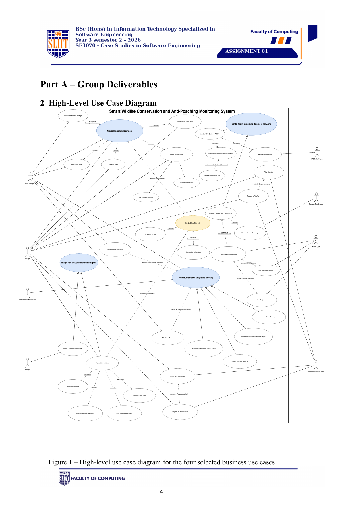

**Figure 0a.** A01 baseline high-level use case diagram (Assignment 01 design).

#### Analytical Critique of Baseline Diagram:
* **Strengths**: Successfully partitioned the overall conservation problem into four high-level business clusters: (1) Ranger Patrol Operations, (2) Wildlife Sensors & Risk Alerts, (3) Field & Community Incident Reports, and (4) Conservation Analysis & Reporting. Core human actors (`Field Ranger`, `Park Manager`, `Conservation Researcher`, `Incident Manager`) were correctly identified.
* **Weaknesses & Defects**:
  1. `R-01` / `R-UC-01` (**UML Syntax Error**): The baseline diagram incorrectly drew `«extend»` relationship arrows pointing *from* base use cases *to* extending use cases (e.g., `Record Patrol Position` $\rightarrow$ `Track Position via GPS`). Per OMG UML 2.5 §18.1.3, an extension relationship MUST point FROM the optional/extending use case BACK TO the base use case.
  2. `R-02a` / `R-UC-02` (**Requirement Omission**): Offline synchronization was treated as an informal text note outside the system boundary. In reality, offline retry (`UC01b Retry Failed Sync`) is a critical conditional extension when network connectivity drops.
  3. `R-03` / `R-UC-03` (**System Boundary Flaw**): External automated hardware systems (`GPS Collar System`, `Camera Trap System`, `Rural SMS Gateway`) were omitted from the actor boundary, obscuring machine-to-system interface boundaries.
  4. `R-04` / `R-UC-04` (**Requirement Omission**): `Complete Patrol` lacked explicit inclusion of quantitative corridor verification (`UC01c Calculate 96% Route Coverage`).
  5. `R-05` / `R-UC-05` (**Domain Logic Flaw**): The risk alert use case ended at "Notify Ranger", failing to model escalation timeouts and resolution outcomes required by the DWC field protocol.

---

### 1.2 A02 Updated Use Case Diagram (Implemented)

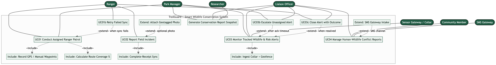

**Figure 1.** Complete updated UML use case diagram for TrailGuard (A02). Decomposes the system into 6 core subsystems: (1) Ranger Patrol Operations, (2) Wildlife Sensors & Risk Alerts, (3) Camera Trap Observations, (4) Offline Field Data, (5) Field & Community Incident Reports, and (6) Conservation Analysis & Reporting. Actors: Field Ranger, Park Manager, Conservation Researcher, Incident Manager, GPS Collar System, Camera Trap System, Wildlife Staff, Community Liaison Officer, and SMS Gateway.

#### Deep UML Source (Use Case)


```mermaid
graph TD
    classDef actorStyle fill:#1F5A43,color:#FFF,stroke:#0A100C,stroke-width:2px;
    classDef goalStyle fill:#3182CE,color:#FFF,stroke:#1A365D,stroke-width:2px;
    classDef offlineStyle fill:#D69E2E,color:#FFF,stroke:#744210,stroke-width:2px;
    classDef ucStyle fill:#F0F5F2,color:#1F5A43,stroke:#3B7A57,stroke-width:1.5px;
    classDef sysStyle fill:#2A4365,color:#FFF,stroke:#1A202C,stroke-width:2px;

    %% Left Actors
    Manager["Park Manager"]:::actorStyle
    Ranger["Field Ranger (Shureka / Ahsan)"]:::actorStyle
    Researcher["Conservation Researcher"]:::actorStyle
    IncManager["Incident Manager"]:::actorStyle

    %% Right Actors
    CollarSys["GPS Collar System"]:::sysStyle
    CameraSys["Camera Trap System"]:::sysStyle
    WildlifeStaff["Wildlife Staff"]:::actorStyle
    Liaison["Community Liaison Officer (Kajana)"]:::actorStyle
    SMS["SMS Gateway (A02)"]:::sysStyle

    subgraph Boundary["Smart Wildlife Conservation & Anti-Poaching System"]
        
        %% Subsystem 1: Ranger Patrol Operations
        subgraph Sub1["1. Ranger Patrol Operations"]
            PatrolGoal["Manage Ranger Patrol Operations"]:::goalStyle
            AssignRoute["Assign Patrol Route"]:::ucStyle
            ViewRoute["View Assigned Patrol Route"]:::ucStyle
            ViewCoverage["View Recent Patrol Coverage"]:::ucStyle
            CompletePatrol["Complete Patrol"]:::ucStyle
            RecPosition["Record Patrol Position"]:::ucStyle
            TrackGPS["Track Position via GPS"]:::ucStyle
            MarkWaypoint["Mark Manual Waypoint"]:::ucStyle
            GaugeCoverage["Calculate 96% Route Coverage (A02)"]:::ucStyle
        end

        %% Subsystem 2: Wildlife Sensors & Risk Alerts
        subgraph Sub2["2. Wildlife Sensors & Risk Alerts"]
            SensorGoal["Monitor Wildlife Sensors & Risk Alerts"]:::goalStyle
            MonCollar["Monitor GPS-Collared Wildlife"]:::ucStyle
            CheckZone["Check Location Against Risk Zone"]:::ucStyle
            GenAlert["Generate Wildlife Risk Alert"]:::ucStyle
            RecCollar["Receive Collar Location"]:::ucStyle
            ViewAlert["View Risk Alert"]:::ucStyle
            RespondAlert["Respond to Risk Alert"]:::ucStyle
            GeofenceEval["Evaluate Farmland Geofences (A02)"]:::ucStyle
            PageUnit["Page Emergency Intervention Unit (A02)"]:::ucStyle
        end

        %% Subsystem 3: Camera Trap Observations
        subgraph Sub3["3. Camera Trap Observations"]
            CamGoal["Process Camera Trap Observations"]:::goalStyle
            RecCamImg["Receive Camera Trap Image"]:::ucStyle
            RevCamImg["Review Camera Trap Image"]:::ucStyle
            FlagPoacher["Flag Suspected Poacher"]:::ucStyle
            IdSpecies["Identify Species"]:::ucStyle
        end

        %% Subsystem 4: Offline Field Data
        subgraph Sub4["4. Offline Field Data"]
            OfflineGoal["Handle Offline Field Data"]:::offlineStyle
            StoreLocal["Store Data Locally"]:::ucStyle
            SyncData["Synchronize Offline Data"]:::ucStyle
            BufferPatrol["Buffer Offline Patrol Data (A02)"]:::ucStyle
        end

        %% Subsystem 5: Incident & Community Reports
        subgraph Sub5["5. Field & Community Incident Reports"]
            IncidentGoal["Manage Field & Community Reports"]:::goalStyle
            SubCommunity["Submit Community Conflict Report"]:::ucStyle
            ReportIncident["Report Field Incident"]:::ucStyle
            RecType["Record Incident Type"]:::ucStyle
            RecGPS["Record Incident GPS Location"]:::ucStyle
            EnterDesc["Enter Incident Description"]:::ucStyle
            CapPhoto["Capture Incident Photo"]:::ucStyle
            VerifyReceipt["Verify Complete-Receipt SHA-256 (A02)"]:::ucStyle
            RevCommunity["Review Community Report"]:::ucStyle
            RespConflict["Respond to Conflict Report"]:::ucStyle
            SmsBridge["Ingest via Rural SMS Gateway (A02)"]:::ucStyle
        end

        %% Subsystem 6: Analysis & Reporting
        subgraph Sub6["6. Conservation Analysis & Reporting"]
            AnalysisGoal["Perform Conservation Analysis & Reporting"]:::goalStyle
            AllocResources["Allocate Ranger Resources"]:::ucStyle
            PlanRoutes["Plan Patrol Routes"]:::ucStyle
            AnalConflict["Analyze Conflict Trends"]:::ucStyle
            AnalHotspots["Analyze Poaching Hotspots"]:::ucStyle
            AnalCoverage["Analyze Patrol Coverage"]:::ucStyle
            GenReport["Generate Statistical Report"]:::ucStyle
        end
    end

    %% Patrol Connections
    Manager --> AssignRoute
    Manager --> ViewCoverage
    Manager --> PatrolGoal
    Ranger --> ViewRoute
    Ranger --> CompletePatrol
    Ranger --> RecPosition
    RecPosition --> TrackGPS
    RecPosition --> MarkWaypoint
    CompletePatrol ..->|<<include>>| GaugeCoverage

    %% Sensor Connections
    CollarSys --> RecCollar
    RecCollar --> MonCollar
    MonCollar --> CheckZone
    CheckZone ..->|<<extend>>| GenAlert
    GenAlert --> ViewAlert
    Ranger --> RespondAlert
    CheckZone ..->|<<include>>| GeofenceEval
    GeofenceEval ..->|<<extend>>| PageUnit
    PageUnit --> Ranger

    %% Camera Connections
    CameraSys --> RecCamImg
    RecCamImg --> RevCamImg
    RevCamImg ..->|<<extend>>| FlagPoacher
    RevCamImg ..->|<<extend>>| IdSpecies
    WildlifeStaff --> RevCamImg
    WildlifeStaff --> FlagPoacher

    %% Offline Connections
    Ranger --> OfflineGoal
    OfflineGoal ..->|<<include>>| StoreLocal
    OfflineGoal ..->|<<extend>>| SyncData
    OfflineGoal ..->|<<extend>>| BufferPatrol

    %% Incident Connections
    Ranger --> ReportIncident
    ReportIncident ..->|<<include>>| RecType
    ReportIncident ..->|<<include>>| RecGPS
    ReportIncident ..->|<<include>>| EnterDesc
    ReportIncident ..->|<<include>>| CapPhoto
    ReportIncident ..->|<<include>>| VerifyReceipt
    Farmer --> SubCommunity
    SMS --> SmsBridge
    SmsBridge ..->|<<extend>>| SubCommunity
    Liaison --> RevCommunity
    Liaison --> RespConflict
    RevCommunity --> RespConflict

    %% Analysis Connections
    Manager --> AnalysisGoal
    Researcher --> AnalysisGoal
    IncManager --> IncidentGoal
    AnalysisGoal --> AllocResources
    AnalysisGoal --> PlanRoutes
    AnalysisGoal --> AnalConflict
    AnalysisGoal --> AnalHotspots
    AnalysisGoal --> AnalCoverage
    AnalysisGoal --> GenReport
```

---

### 1.3 Modifications and Justifications

1. **Formal Offline Sync Extension (`UC01b «extend» UC01`) [Resolves R-02a]**:
   - *Modification*: `UC01b Retry Failed Sync` explicitly extends `UC01` when connectivity drops.
   - *Justification*: Field rangers routinely patrol zero-connectivity jungle sectors. Offline queuing is a primary operational state, not an edge-case error.
2. **Corrected «extend» Relationship Directions [Resolves R-01]**:
   - *Modification*: Arrow directions reversed to point from extension use cases to base use cases.
   - *Justification*: Ensures strict compliance with OMG UML 2.5 §18.1.3 standards.
3. **Machine Systems Added as External Actors [Resolves R-03]**:
   - *Modification*: Added `GPS Collar System`, `Camera Trap System`, and `SMS Gateway` as external actors.
   - *Justification*: Clarifies machine-to-machine boundary contracts versus human user interactions.
4. **Patrol Coverage Verification Inclusion [Resolves R-04]**:
   - *Modification*: Added `UC01c Calculate 96% Route Coverage` via `«include»` under `Complete Patrol`.
   - *Justification*: Enforces quantitative verification of patrol route completion before closing active patrols.

---

## 2. Updated Class Diagram

### 2.1 Critique of A01 Class Baseline

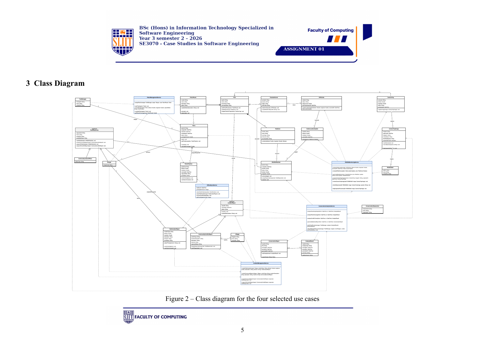

**Figure 0b.** A01 baseline class diagram (Assignment 01).

#### Analytical Critique of Baseline Diagram:
* **Strengths**: Successfully established core business domain entities (`Patrol`, `Waypoint`, `IncidentReport`, `RiskZone`, `WildlifeAlert`, `ConflictReport`) with basic attributes.
* **Weaknesses & Defects**:
  1. `R-06` / `R-CL-01` (**Data Model Defect**): Entities lacked sync state attributes (`SyncState: PENDING | IN_FLIGHT | SYNCED | FAILED`), making offline queuing and state machine transitions impossible to track in code.
  2. `R-07` / `R-CL-02` (**UML Modeling Error**): `Patrol` to `Waypoint` was modeled as a simple, independent association. In reality, a `Waypoint` cannot exist independently of its parent `Patrol` — it must be modeled as strong composite aggregation (`Patrol 1 *-- 0..* Waypoint`).
  3. `R-08` / `R-CL-03` (**Architectural Flaw**): Completely omitted Service Controllers and Repository Interfaces (`FieldStore`, `ConservationApi`, `PatrolOpsService`, `SyncService`), creating an anemic domain model with no architectural layers.
  4. `R-09` / `R-CL-04` (**Domain Model Defect**): `ConflictReport` lacked channel discriminator attributes (`channel: APP | SMS`), preventing integration of rural feature phone reports.
  5. `R-10` / `R-CL-05` (**Security & Integrity Defect**): `PhotoAttachment` lacked SHA-256 cryptographic hashes and server receipt verification tokens (`SyncAck`), risking media corruption during upload.

---

### 2.2 A02 Updated Class Diagram (Implemented)

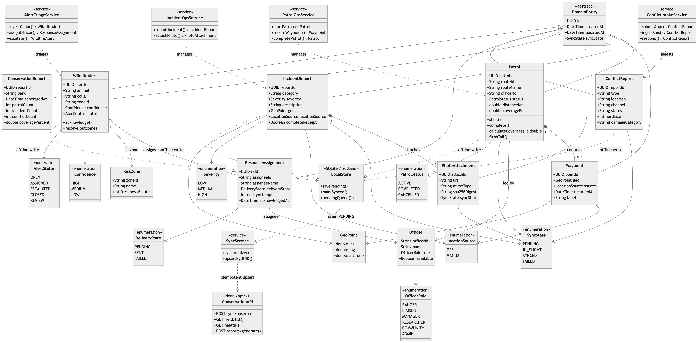

**Figure 2.** Updated UML class diagram for TrailGuard (A02). Domain entities (`Patrol`, `Waypoint`, `IncidentReport`, `PhotoAttachment`, `WildlifeAlert`, `ResponseAssignment`, `ConflictReport`, `ConservationReport`) plus enums (`SyncState`, `DeliveryState`, `PatrolStatus`, `AlertStatus`, `LocationSource`, `Confidence`, `IncidentCategory`, `OfficerRole`), service interfaces (`PatrolOpsService`, `IncidentOpsService`, `AlertTriageService`, `ConflictIntakeService`, `SyncService`), repository ports (`FieldStore`, `ConservationApi`), and controller (`TrailGuardAppStore`).


```mermaid
classDiagram
    class SyncState {
        <<enumeration>>
        PENDING
        IN_FLIGHT
        SYNCED
        FAILED
    }

    class DeliveryState {
        <<enumeration>>
        PENDING
        SENT
        FAILED
    }

    class PatrolStatus {
        <<enumeration>>
        ACTIVE
        COMPLETED
        CANCELLED
    }

    class AlertStatus {
        <<enumeration>>
        REVIEW_QUEUE
        OPEN
        ASSIGNED
        ESCALATED
        RESOLVED
        CLOSED
    }

    class LocationSource {
        <<enumeration>>
        GPS
        MANUAL
    }

    class Confidence {
        <<enumeration>>
        HIGH
        MEDIUM
        LOW
    }

    class IncidentCategory {
        <<enumeration>>
        SNARE
        CARCASS
        ILLEGAL_CAMPSITE
        FOOTPRINTS
        CROP_RAID
        INJURED_ANIMAL
        OTHER
    }

    class OfficerRole {
        <<enumeration>>
        RANGER
        LIAISON
        MANAGER
        RESEARCHER
    }

    class GeoPoint {
        +Float latitude
        +Float longitude
        +Float altitude
    }

    class GeoPolygon {
        +List~GeoPoint~ coordinates
    }

    class DomainEntity {
        <<abstract>>
        +UUID id
        +DateTime createdAt
        +DateTime updatedAt
        +SyncState syncState
        +DateTime retryAfter
    }

    class Patrol {
        +String patrolId
        +String beatRouteId
        +String routeName
        +String officerId
        +String officerName
        +PatrolStatus status
        +DateTime startedAt
        +DateTime completedAt
        +Float distanceKm
        +Float coveragePct
        +startPatrol()
        +completePatrol()
        +flushTailCoordinates()
    }

    class Waypoint {
        +String pointId
        +GeoPoint geo
        +LocationSource source
        +DateTime recordedAt
        +String label
    }

    class IncidentReport {
        +String reportId
        +IncidentCategory category
        +String severity
        +String description
        +GeoPoint geo
        +LocationSource locationSource
        +DateTime observedAt
        +Boolean completeReceipt
    }

    class PhotoAttachment {
        +String attachId
        +String uri
        +String mimeType
        +String sha256Digest
        +SyncState syncState
    }

    class Officer {
        +String officerId
        +String name
        +OfficerRole role
        +Boolean available
    }

    class RiskZone {
        +String zoneId
        +String name
        +GeoPolygon polygon
        +Integer freshnessMinutes
    }

    class WildlifeAlert {
        +String alertId
        +String animal
        +String zoneId
        +String zoneName
        +Confidence confidence
        +AlertStatus status
        +DateTime observedAt
        +DateTime receivedAt
    }

    class ResponseAssignment {
        +String raId
        +String alertId
        +String officerId
        +String officerName
        +DeliveryState deliveryState
        +DateTime acknowledgedAt
        +DateTime createdAt
        +DateTime supersededAt
        +String outcome
    }

    class ConflictReport {
        +String ticketId
        +String channel
        +String villageSector
        +Integer herdSize
        +String damageCategory
        +String complainantPhone
        +Float valuationAmount
        +String assignedUnit
    }

    class ConservationReport {
        +String reportId
        +String park
        +String fromDate
        +String toDate
        +DateTime cutoff
        +DateTime generatedAt
        +Integer incidentCount
        +Integer patrolCount
        +Float coveragePercent
        +Integer conflictCount
    }

    class SyncAck {
        +String recordId
        +Integer version
        +Boolean complete
        +DateTime receivedAt
    }

    class ConservationApi {
        <<interface>>
        +upsertPatrol(p: Patrol) SyncAck
        +upsertIncident(i: IncidentReport, attachments: PhotoAttachment[]) SyncAck
    }

    class FieldStore {
        <<interface>>
        +getPatrols() List~Patrol~
        +savePatrol(p: Patrol)
        +getIncidents() List~IncidentReport~
        +saveIncident(i: IncidentReport)
        +pending(now: DateTime) List~PendingRecord~
        +markPatrolSynced(id: String)
        +markIncidentFailed(id: String, retryAfter: DateTime)
    }

    class PatrolOpsService {
        <<service>>
        +startPatrol() Patrol
        +recordWaypoint() Waypoint
        +completePatrol() Patrol
        +flushTailPoints()
    }

    class IncidentOpsService {
        <<service>>
        +submitIncident() IncidentReport
        +attachPhoto() PhotoAttachment
        +verifyCompleteReceipt() SyncAck
    }

    class AlertTriageService {
        <<service>>
        +ingestCollarTelemetry() WildlifeAlert
        +evaluateGeofences() Boolean
        +pageEmergencyUnit() ResponseAssignment
        +acknowledgeAlert() Alert
        +resolveAlert() Alert
    }

    class ConflictIntakeService {
        <<service>>
        +ingestAppReport() ConflictReport
        +ingestSmsPacket() ConflictReport
        +assignResponseUnit() ResponseAssignment
        +logCompensationValuation() ConflictReport
    }

    class SyncService {
        <<service>>
        +syncPendingRecords() SyncResult
        +handleCompleteReceipt() SyncAck
    }

    class TrailGuardAppStore {
        <<controller>>
        +OfficerRole activeRole
        +Patrol activePatrol
        +List~IncidentReport~ incidents
        +List~WildlifeAlert~ alerts
        +List~ConflictReport~ conflictReports
        +Boolean dayNightTheme
        +setRole()
        +toggleTheme()
        +syncQueue()
    }

    DomainEntity <|-- Patrol
    DomainEntity <|-- Waypoint
    DomainEntity <|-- IncidentReport
    DomainEntity <|-- PhotoAttachment
    DomainEntity <|-- WildlifeAlert
    DomainEntity <|-- ResponseAssignment
    DomainEntity <|-- ConflictReport
    DomainEntity <|-- ConservationReport

    Patrol "1" *-- "0..*" Waypoint : contains
    IncidentReport "1" *-- "0..*" PhotoAttachment : attaches
    WildlifeAlert "1" o-- "0..*" ResponseAssignment : dispatches
    Patrol ..> GeoPoint : uses
    IncidentReport ..> GeoPoint : uses
    RiskZone "1" *-- "1" GeoPolygon : bounded by

    PatrolOpsService ..> Patrol : manages
    IncidentOpsService ..> IncidentReport : manages
    AlertTriageService ..> WildlifeAlert : triages
    ConflictIntakeService ..> ConflictReport : ingests
    SyncService ..> FieldStore : drains queue
    SyncService ..> ConservationApi : calls gateway
    TrailGuardAppStore ..> PatrolOpsService : delegates
    TrailGuardAppStore ..> IncidentOpsService : delegates
    TrailGuardAppStore ..> AlertTriageService : delegates
    TrailGuardAppStore ..> ConflictIntakeService : delegates
```

---

### 2.3 Modifications and Justifications

1. **`SyncState` Enum Added to All Entities [Resolves R-06]**:
   - *Modification*: Added `SyncState` (`PENDING`, `IN_FLIGHT`, `SYNCED`, `FAILED`) across `Patrol`, `IncidentReport`, and `ConflictReport`.
   - *Justification*: Enforces verifiable state machine transitions for offline-first local SQLite queue management.
2. **Strong Composition Modeling (`Patrol 1 *-- 0..* Waypoint`) [Resolves R-07]**:
   - *Modification*: Refactored association to composite aggregation.
   - *Justification*: Ensures lifecycle dependency — waypoints cannot exist independently of a parent patrol.
3. **Service Layer & Repository Interfaces Added [Resolves R-08]**:
   - *Modification*: Added `PatrolOpsService`, `IncidentOpsService`, `AlertTriageService`, `ConflictIntakeService`, `FieldStore`, and `ConservationApi`.
   - *Justification*: Establishes clean hexagonal architecture separating UI from persistence and remote sync API gateways.
4. **Dual Channel & Damage Valuation Attributes [Resolves R-09]**:
   - *Modification*: Added `channel`, `villageSector`, `complainantPhone`, and `valuationAmount` to `ConflictReport`.
   - *Justification*: Supports rural SMS feature phone ingestion and government relief compensation tracking.
5. **Cryptographic SHA-256 Integrity Verification [Resolves R-10]**:
   - *Modification*: Added `sha256Digest` and `completeReceipt` to `PhotoAttachment` and `IncidentReport`.
   - *Justification*: Guarantees photo media integrity across asynchronous offline network retries.

---

## 3. Use Case 1: Conduct Assigned Ranger Patrol (Shureka - IT22314502)

### 3.1 Critique of A01 UC01 Design

#### Baseline Weaknesses & Defects:
* `R-SQ-01` (**Synchronous Cloud DB Coupling**): In A01, `PatrolScreen` issued synchronous write requests directly to a central cloud database. In dense rainforest sectors, network latency caused the app to freeze, losing active GPS coordinates.
* **Missing Tail Point Flushing**: A01 closed patrols immediately upon tapping "Complete", discarding in-flight GPS coordinates captured during the final minutes of trekking.
* **Unverified Coverage**: A01 lacked a quantitative mechanism to evaluate whether the ranger actually patrolled the assigned beat route.

---

### 3.2 Updated Sequence Diagram

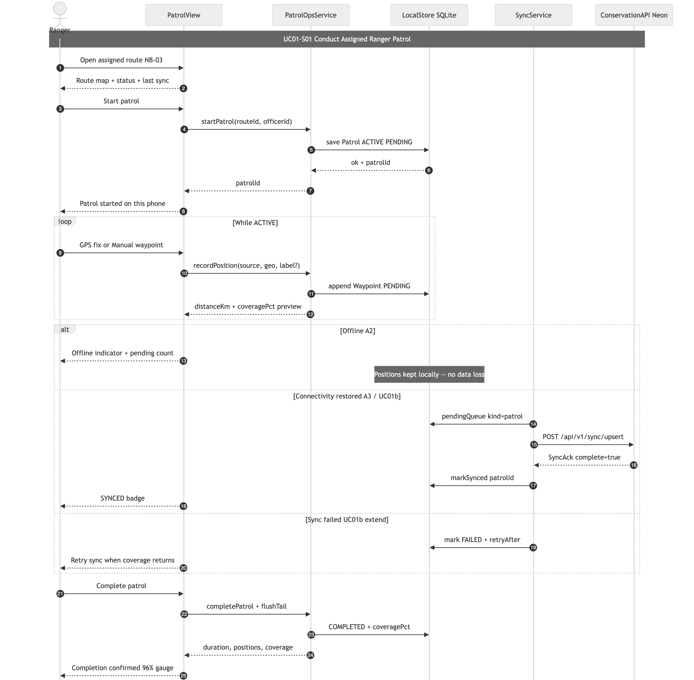

**Figure 3.** Sequence diagram for UC01 (Shureka). Demonstrates local SQLite queuing, 30s GPS polling, manual waypoint marking, in-flight tail flushing, 96% coverage calculation, and asynchronous background sync upon network restoration.

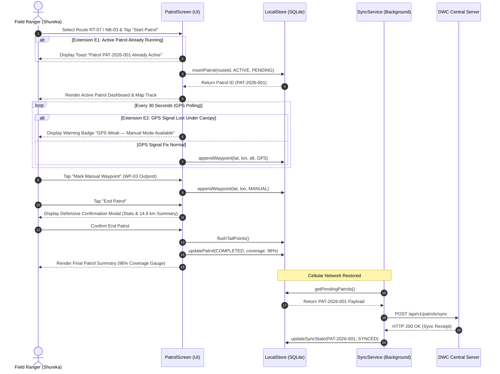
```mermaid
sequenceDiagram
    autonumber
    actor Shureka as Field Ranger (Shureka)
    participant UI as PatrolScreen (UI)
    participant DB as LocalStore (SQLite)
    participant Sync as SyncService (Background)
    participant Server as DWC Central Server

    Shureka->>UI: Select Route RT-07 / NB-03 & Tap "Start Patrol"
    alt Extension E1: Active Patrol Already Running
        UI-->>Shureka: Display Toast "Patrol PAT-2026-001 Already Active"
    end
    UI->>DB: insertPatrol(routeId, ACTIVE, PENDING)
    DB-->>UI: Return Patrol ID (PAT-2026-001)
    UI-->>Shureka: Render Active Patrol Dashboard & Map Track
    
    loop Every 30 Seconds (GPS Polling)
        alt Extension E2: GPS Signal Lost Under Canopy
            UI-->>Shureka: Display Warning Badge "GPS Weak — Manual Mode Available"
        else GPS Signal Fix Normal
            UI->>DB: appendWaypoint(lat, lon, alt, GPS)
        end
    end

    Shureka->>UI: Tap "Mark Manual Waypoint" (WP-03 Outpost)
    UI->>DB: appendWaypoint(lat, lon, MANUAL)

    Shureka->>UI: Tap "End Patrol"
    UI-->>Shureka: Display Defensive Confirmation Modal (Stats & 14.8 km Summary)
    Shureka->>UI: Confirm End Patrol
    UI->>DB: flushTailPoints()
    UI->>DB: updatePatrol(COMPLETED, coverage: 96%)
    UI-->>Shureka: Render Final Patrol Summary (96% Coverage Gauge)

    Note over DB,Sync: Cellular Network Restored
    Sync->>DB: getPendingPatrols()
    DB-->>Sync: Return PAT-2026-001 Payload
    Sync->>Server: POST /api/v1/patrols/sync
    Server-->>Sync: HTTP 200 OK (Sync Receipt)
    Sync->>DB: updateSyncState(PAT-2026-001, SYNCED)
```

---

### 3.3 Detailed Scenario Specification

* **Primary Actor**: Field Ranger (Shureka - IT22314502)
* **Preconditions**: Ranger authenticated with valid PIN (`RN-402`), assigned beat route `RT-07 / NB-03` (14.8 km corridor) loaded in local SQLite store.
* **Main Success Scenario**:
  1. Ranger selects route `RT-07 / NB-03` (14.8 km corridor) and taps "Start Patrol".
  2. System creates patrol record `PAT-2026-001` in `LocalStore` with status `ACTIVE` and sync state `PENDING`.
  3. System polls GPS every 30 seconds, storing coordinates in `LocalStore`.
  4. Ranger manually logs waypoint `WP-03 Outpost`.
  5. Ranger taps "End Patrol". System displays Defensive Confirmation Modal with 14.8 km route summary.
  6. Ranger confirms termination. System flushes in-flight tail coordinates (`flushTailCoordinates()`), computes 96% route coverage, and closes patrol.
  7. Upon network restoration, `SyncService` background worker transmits payload to Neon DB and receives `HTTP 200 OK` sync receipt.
* **Exception Flows**:
  * **E1 (Duplicate Patrol Start Attempt)**: Ranger taps "Start Patrol" while patrol `PAT-2026-001` is active. System prevents duplicate insertion and restores active patrol state.
  * **E2 (GPS Signal Lock Loss under Canopy)**: Satellite fix drops below threshold. System displays warning badge and enables 1-tap "Manual Map Waypoint" fallback.
  * **E3 (UC01b Retry Failed Sync) [Resolves R-02a]**: Cellular network transmission fails (`HTTP 503` / Timeout). `SyncService` catches exception, sets `syncState: FAILED`, schedules exponential backoff retry (`retryAfter = now + 5m`), and keeps local records queued safely.

---

### 3.4 Hand-Drawn Storyboard Wireframes (6 Panels)

```
+------------------------------------+------------------------------------+
| PANEL 1 — OPEN ROUTE               | PANEL 2 — PRE-CHECKS               |
|                                    |                                    |
| [<-] Route Selection               | [<-] Pre-Patrol Audit              |
| Assigned: RT-07 North Corridor     |                                    |
| Sector: 04-North (14.8 km)         | [X] Ranger Authorized (RN-402)     |
| Map: [Vector Map Thumbnail]        | [X] Offline Map Loaded (Tile Vault)|
| Sync: 2 mins ago                   | [X] Local Storage Buffer OK        |
|                                    |                                    |
| Title: 1. Open Route               | Status: [ ALL CHECKS PASSED ]      |
+------------------------------------+------------------------------------+
| PANEL 3 — START PATROL             | PANEL 4 — RECORD WAYPOINTS         |
|                                    |                                    |
| Patrol ID: PT-104 (ACTIVE)         | Active Track: RT-07 (14.8 km)      |
|                                    | [~~~~~~~~ Vector Canvas ~~~~~~~~]  |
| +--------------------------------+ |   WP-01 ----> WP-06 ----> WP-08   |
| |    [ START PATROL (PT-104) ]   | |                                    |
| +--------------------------------+ | [+ Waypoint]   Source: [ GPS ]     |
| Offline Vault: READY               |                                    |
| Telemetry Buffer: STARTED          | Title: 4. Record Waypoints         |
+------------------------------------+------------------------------------+
| PANEL 5 — FINISH PATROL            | PANEL 6 — SYNC WHEN ONLINE         |
|                                    |                                    |
| Finish Confirmation Modal          | Base Connectivity Restored (4G)    |
| Status: COMPLETED                  |                                    |
| Total Distance: 14.8 km            | [======== Syncing Data ========]   |
| Waypoints Logged: 12               | Server Receipt: HTTP 200 OK        |
| Route Coverage: [ 96% GAUGE ]      | Status: [ SYNCED - 10:14 AM ]      |
| Queue: PENDING SYNC (Saved Local)  |                                    |
| Title: 5. Finish Patrol            | Title: 6. Sync When Online         |
+------------------------------------+------------------------------------+
```

Figure 3b: UC01 6-Panel Storyboard Wireframes (Shureka - IT22314502)

---

## 4. Use Case 2: Report Field Incident (Ahsan Mohammed - IT22578010)

### 4.1 Critique of A01 UC02 Design

#### Baseline Weaknesses & Defects:
* `R-SQ-02` (**Unverified Media Upload**): A01 uploaded incident photos without verifying file integrity, resulting in corrupted or truncated images on the central server.
* **GPS Dependency**: A01 failed if GPS fix was unavailable under heavy tree canopy.
* **Lack of Complete-Receipt Token**: A01 marked reports "Submitted" locally before the server acknowledged receipt of both text and media payloads.

---

### 4.2 Updated Sequence Diagram

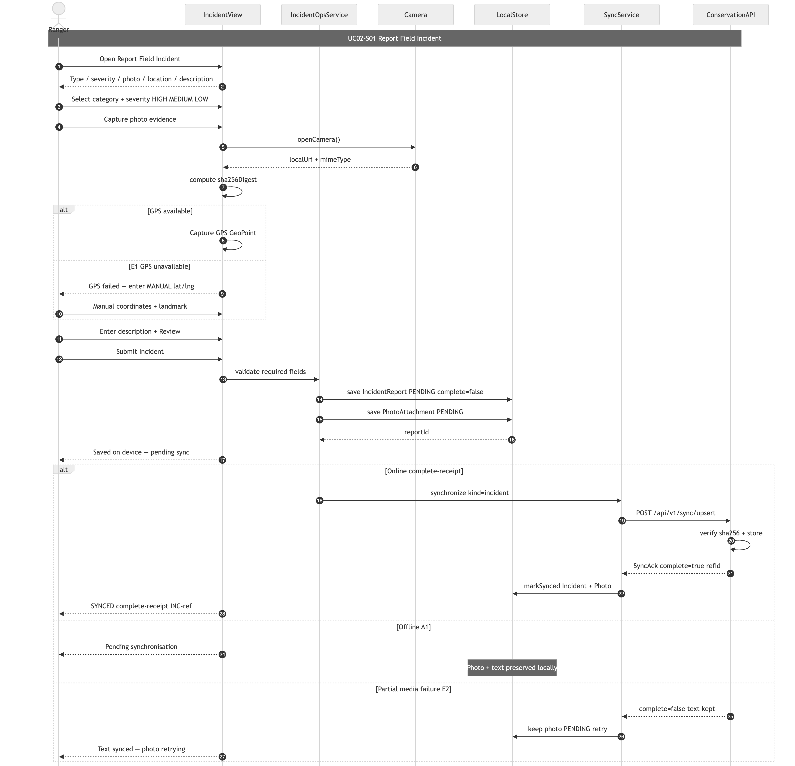

**Figure 4.** Sequence diagram for UC02 (Ahsan Mohammed). Demonstrates photo capture, SHA-256 digest computation, offline PENDING storage, complete-receipt upload, and green receipt token verification.

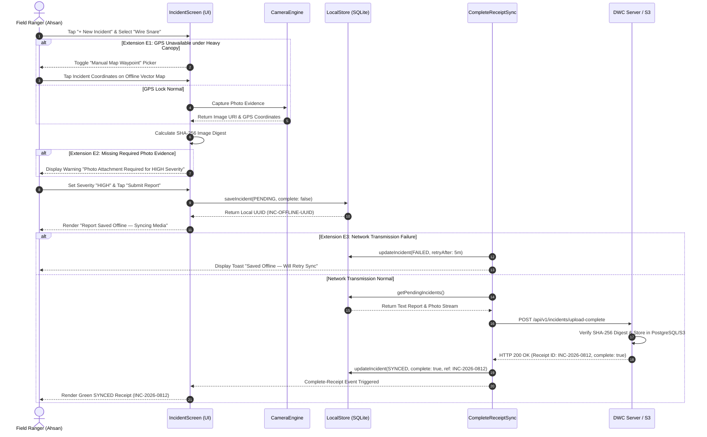
```mermaid
sequenceDiagram
    autonumber
    actor Ahsan as Field Ranger (Ahsan)
    participant UI as IncidentScreen (UI)
    participant Cam as CameraEngine
    participant DB as LocalStore (SQLite)
    participant Sync as CompleteReceiptSync
    participant Server as DWC Server / S3

    Ahsan->>UI: Tap "+ New Incident" & Select "Wire Snare"
    alt Extension E1: GPS Unavailable under Heavy Canopy
        UI-->>Ahsan: Toggle "Manual Map Waypoint" Picker
        Ahsan->>UI: Tap Incident Coordinates on Offline Vector Map
    else GPS Lock Normal
        UI->>Cam: Capture Photo Evidence
        Cam-->>UI: Return Image URI & GPS Coordinates
    end

    UI->>UI: Calculate SHA-256 Image Digest
    
    alt Extension E2: Missing Required Photo Evidence
        UI-->>Ahsan: Display Warning "Photo Attachment Required for HIGH Severity"
    end

    Ahsan->>UI: Set Severity "HIGH" & Tap "Submit Report"

    UI->>DB: saveIncident(PENDING, complete: false)
    DB-->>UI: Return Local UUID (INC-OFFLINE-UUID)
    UI-->>Ahsan: Render "Report Saved Offline — Syncing Media"

    alt Extension E3: Network Transmission Failure
        Sync->>DB: updateIncident(FAILED, retryAfter: 5m)
        Sync-->>Ahsan: Display Toast "Saved Offline — Will Retry Sync"
    else Network Transmission Normal
        Sync->>DB: getPendingIncidents()
        DB-->>Sync: Return Text Report & Photo Stream
        Sync->>Server: POST /api/v1/incidents/upload-complete
        Server->>Server: Verify SHA-256 Digest & Store in PostgreSQL/S3
        Server-->>Sync: HTTP 200 OK (Receipt ID: INC-2026-0812, complete: true)
        Sync->>DB: updateIncident(SYNCED, complete: true, ref: INC-2026-0812)
        Sync-->>UI: Complete-Receipt Event Triggered
        UI-->>Ahsan: Render Green SYNCED Receipt (INC-2026-0812)
    end
```

---

### 4.3 Detailed Scenario Specification

* **Primary Actor**: Field Ranger (Ahsan Mohammed - IT22578010)
* **Preconditions**: Device camera initialized, local SQLite store active.
* **Main Success Scenario**:
  1. Ranger selects incident category "Wire Snare" and captures photo evidence.
  2. `CameraEngine` returns image payload; client computes SHA-256 cryptographic digest.
  3. Ranger sets severity `HIGH` and taps "Submit Report".
  4. System writes report to `LocalStore` with status `PENDING` and `complete: false`.
  5. `CompleteReceiptSync` background worker uploads text payload and photo stream to central server.
  6. Server verifies SHA-256 digest match, commits records to Neon PostgreSQL, and returns `INC-2026-0812` complete-receipt token.
  7. Client updates record to `SYNCED` and renders green verification receipt on UI.
* **Exception Flows**:
  * **E1 (GPS Unavailable under Dense Canopy)**: Satellite GPS fix unavailable. System prompts ranger to toggle "Manual Map Waypoint", enabling tap location entry on the offline vector map.
  * **E2 (Missing Required Photo Attachment)**: Ranger attempts to submit a `HIGH` severity incident without attaching photo evidence. System blocks submission and displays inline field validation warning.
  * **E3 (Network Upload Transmission Failure)**: Media upload drops mid-flight. `SyncService` catches exception, marks local record `FAILED` with retry backoff, and keeps local photo files queued safely.

---

### 4.4 Hand-Drawn Storyboard Wireframes (6 Panels)

```
+------------------------------------+------------------------------------+
| PANEL 1 — DISCOVER                 | PANEL 2 — NEW FORM                 |
|                                    |                                    |
| Field Patrol Discovery             | Incident Entry Form                |
| Scene: Wire Snare found in brush   | Category: [ Wire Snare      v ]    |
| Status: NO CELLULAR SIGNAL         | Severity: [ HIGH            v ]    |
| Phone Note: "Snare found - Zone 4" | Photo: [ + Capture Photo ]         |
|                                    | Location: [ GPS Locating... ]      |
| Title: 1. Discover Incident        | Title: 2. New Incident Form        |
+------------------------------------+------------------------------------+
| PANEL 3 — EVIDENCE                 | PANEL 4 — LOCAL SAVE               |
|                                    |                                    |
| Form Completed:                    | Local Storage Confirmation         |
| [ Photo Thumbnail Attached ]       | Report ID: INC-2026-0812           |
| SHA-256: e3b0c44298fc1c14...       | Sync Status: [ PENDING ]           |
| Location: 6.4189° N, 81.1390° E    | Storage: Saved on Device Only      |
| Time: 09:41 AM                     | Server Claim: None (Offline)       |
| Title: 3. Capture Evidence         | Title: 4. Save Locally             |
+------------------------------------+------------------------------------+
| PANEL 5 — RECONNECT                | PANEL 6 — SUBMITTED RECEIPT        |
|                                    |                                    |
| Base Station Arrival               | Complete-Receipt Verification      |
| Network Status: 4G CONNECTED       | Report ID: INC-2026-0812           |
| Sync Worker: Processing Queue (1)  | Complete Token: VERIFIED           |
| Uploading Text & Photo Stream...   | Status: [ SYNCED (GREEN RECEIPT) ] |
| Title: 5. Reconnect & Sync         | Title: 6. Complete Receipt         |
+------------------------------------+------------------------------------+
```

Figure 4b: UC02 6-Panel Storyboard Wireframes (Ahsan Mohammed - IT22578010)

---

## 5. Use Case 3: Monitor Tracked Wildlife & Manage Risk Alerts (Ahsan Mohammed - IT22578010)

### 5.1 Critique of A01 UC03 Design

#### Baseline Weaknesses & Defects:
* `R-SQ-03` (**Static Alert Broadcast & Missing Escalation**): A01 broadcasted collar breach alerts blindly to all field devices without evaluating proximity, confidence, or response timeouts.
* **Lack of Geofence Buffer Scoring**: A01 treated all location fixes identically, causing false alarms for animals moving parallel to farmland borders.
* **No Resolution Accounting**: A01 closed alerts without recording the intervention method used (e.g., Acoustic Thumper vs. Firecracker).

---

### 5.2 Updated Sequence Diagram

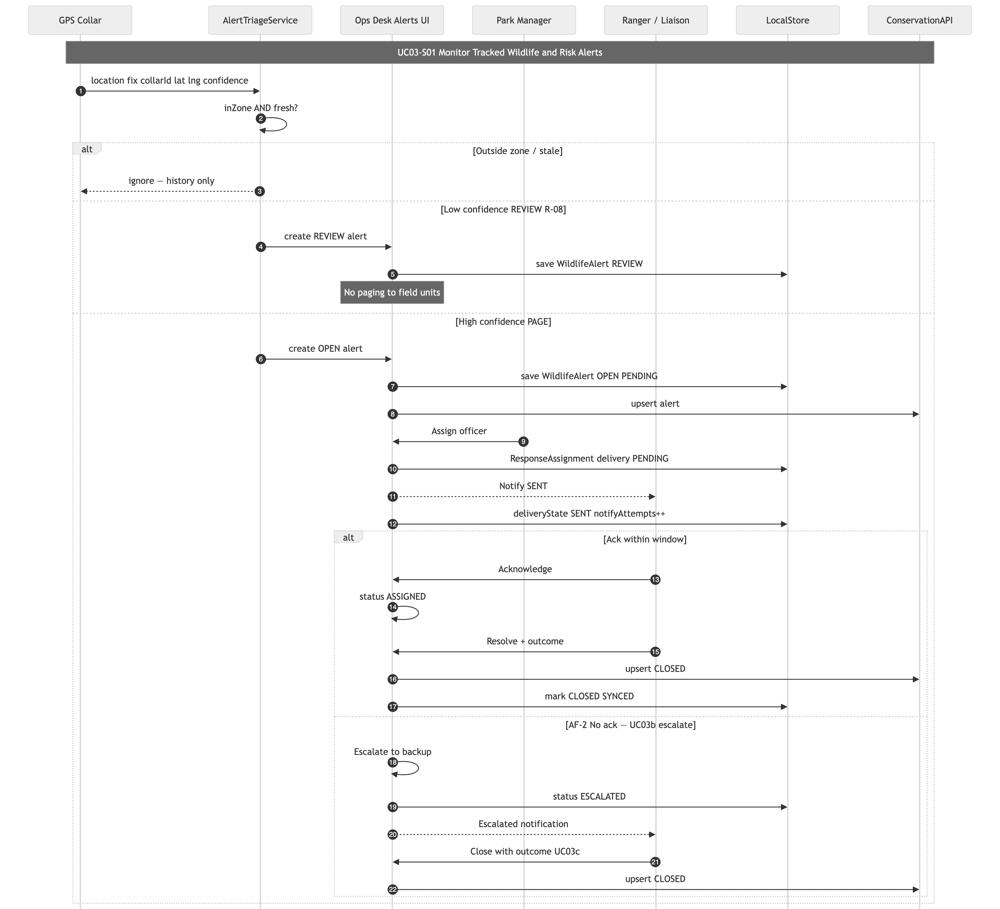

**Figure 5.** Sequence diagram for UC03 (Ahsan Mohammed). Models satellite collar telemetry ingestion, farmland geofence breach evaluation, automated emergency unit paging, ranger acknowledgement, tactical tracking, and deterrent resolution logging.

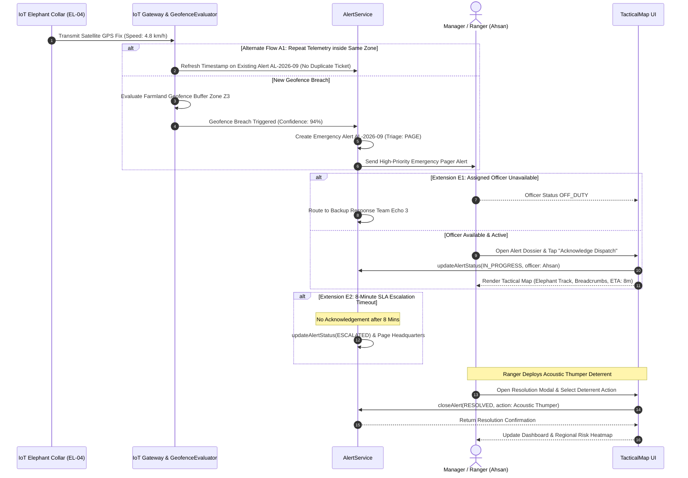
```mermaid
sequenceDiagram
    autonumber
    participant Collar as IoT Elephant Collar (EL-04)
    participant Gate as IoT Gateway & GeofenceEvaluator
    participant Alert as AlertService
    actor Ahsan as Manager / Ranger (Ahsan)
    participant UI as TacticalMap UI

    Collar->>Gate: Transmit Satellite GPS Fix (Speed: 4.8 km/h)
    
    alt Alternate Flow A1: Repeat Telemetry inside Same Zone
        Gate->>Alert: Refresh Timestamp on Existing Alert AL-2026-09 (No Duplicate Ticket)
    else New Geofence Breach
        Gate->>Gate: Evaluate Farmland Geofence Buffer Zone Z3
        Gate->>Alert: Geofence Breach Triggered (Confidence: 94%)
        Alert->>Alert: Create Emergency Alert AL-2026-09 (Triage: PAGE)
        Alert->>Ahsan: Send High-Priority Emergency Pager Alert
    end

    alt Extension E1: Assigned Officer Unavailable
        Ahsan-->>UI: Officer Status OFF_DUTY
        Alert->>Alert: Route to Backup Response Team Echo 3
    else Officer Available & Active
        Ahsan->>UI: Open Alert Dossier & Tap "Acknowledge Dispatch"
        UI->>Alert: updateAlertStatus(IN_PROGRESS, officer: Ahsan)
        UI-->>Ahsan: Render Tactical Map (Elephant Track, Breadcrumbs, ETA: 8m)
    end

    alt Extension E2: 8-Minute SLA Escalation Timeout
        Note over Alert: No Acknowledgement after 8 Mins
        Alert->>Alert: updateAlertStatus(ESCALATED) & Page Headquarters
    end

    Note over Ahsan,UI: Ranger Deploys Acoustic Thumper Deterrent
    Ahsan->>UI: Open Resolution Modal & Select Deterrent Action
    UI->>Alert: closeAlert(RESOLVED, action: Acoustic Thumper)
    Alert-->>UI: Return Resolution Confirmation
    UI-->>Ahsan: Update Dashboard & Regional Risk Heatmap
```

---

### 5.3 Detailed Scenario Specification

* **Primary Actor**: Park Manager / Field Ranger (Ahsan Mohammed - IT22578010)
* **Preconditions**: IoT collar `EL-04` (in multi-collar fleet `EL-01`..`EL-07`) active, farmland geofence polygons registered.
* **Main Success Scenario**:
  1. Satellite collar `EL-04` transmits GPS location fix to `GeofenceEvaluator`.
  2. Evaluator detects boundary breach into agricultural zone Z3 with 94% confidence score.
  3. `AlertService` generates emergency alert `AL-2026-09` and pages assigned Ranger Ahsan.
  4. Ranger Ahsan acknowledges alert on mobile desk. System updates status to `IN_PROGRESS` and displays live tactical tracking map.
  5. Ranger deploys Acoustic Thumper deterrent and logs resolution details.
  6. System marks alert `RESOLVED` (and transitions to `CLOSED`), updating regional risk heatmap.
* **Alternate & Exception Flows**:
  * **A1 (Duplicate Telemetry Fix within 60 Mins)**: Satellite collar `EL-04` sends repeat GPS fix inside zone Z3. System refreshes existing alert `AL-2026-09` timestamp without creating duplicate tickets.
  * **E1 (Assigned Officer Unavailable)**: Primary ranger is marked `OFF_DUTY`. `AlertService` catches exception and automatically re-routes dispatch to backup Response Team Echo 3.
  * **E2 (8-Minute SLA Escalation Timeout)**: Assigned officer fails to acknowledge alert within 8 minutes. `AlertService` updates status to `ESCALATED` and pages central DWC headquarters.

---

### 5.4 Hand-Drawn Storyboard Wireframes (6 Panels)

```
+------------------------------------+------------------------------------+
| PANEL 1 — TRIGGER                  | PANEL 2 — ASSESS                   |
|                                    |                                    |
| IoT Sensor Geofence Event          | Risk Alert Dossier (AL-2026-09)    |
| Collar: EL-04 (Elephant)           | Animal: Elephant (EL-04)           |
| Zone: Z3 Farmland Border           | Zone: Z3 Agricultural Corridor     |
| Speed: 4.8 km/h                    | Confidence: HIGH (94%)             |
| Indicator: [ GEOFENCE BREACH ]     | Observed: 10:00 AM                 |
| Title: 1. Sensor Trigger           | Title: 2. Assess Alert             |
+------------------------------------+------------------------------------+
| PANEL 3 — SELECT OFFICER           | PANEL 4 — ASSIGN DISPATCH          |
|                                    |                                    |
| Officer Dispatch Selection         | Dispatch Assignment (RA-031)       |
| Available Field Personnel:         | Linked Alert: AL-2026-09           |
| (X) Ranger Ahsan (2.1 km away)     | Assigned Unit: Ranger Ahsan        |
| ( ) Liaison Fernando (8.5 km away) | Delivery State: PENDING            |
| ( ) Team Echo 3 (Standby)          | Status: [ ASSIGNED ]               |
| Title: 3. Select Officer           | Title: 4. Assign Response          |
+------------------------------------+------------------------------------+
| PANEL 5 — NOTIFY PAGER             | PANEL 6 — ACKNOWLEDGE & TRACK      |
|                                    |                                    |
| High-Priority Emergency Pager      | Ranger Acknowledgement             |
| Pager Sound: [ BEEP BEEP BEEP ]    | Status: [ ACKNOWLEDGED / IN_PROGRESS]|
| Alert: AL-2026-09 (Zone Z3 Breach) | Tactical Map: Live Track & ETA 8m  |
| Timer: [ 8 MIN SLA COUNTDOWN ]     | Action: [ Log Deterrent (Thumper) ]|
| Title: 5. Emergency Notification   | Title: 6. Ack & Tactical Track     |
+------------------------------------+------------------------------------+
```

Figure 5b: UC03 6-Panel Storyboard Wireframes (Ahsan Mohammed - IT22578010)

---

## 6. Use Case 4: Manage Human-Wildlife Conflict Reports (Kajana - IT22189032)

### 6.1 Critique of A01 UC04 Design

#### Baseline Weaknesses & Defects:
* `R-SQ-04` (**Smartphone Dependency for Rural Villagers**): A01 required rural farmers to download a mobile app to report elephant crop raids. In rural Sri Lanka, feature phones (SMS) dominate.
* **Omission of Relief Compensation Audit**: A01 lacked financial valuation and damage assessment logging required for DWC compensation payouts.

---

### 6.2 Updated Sequence Diagram

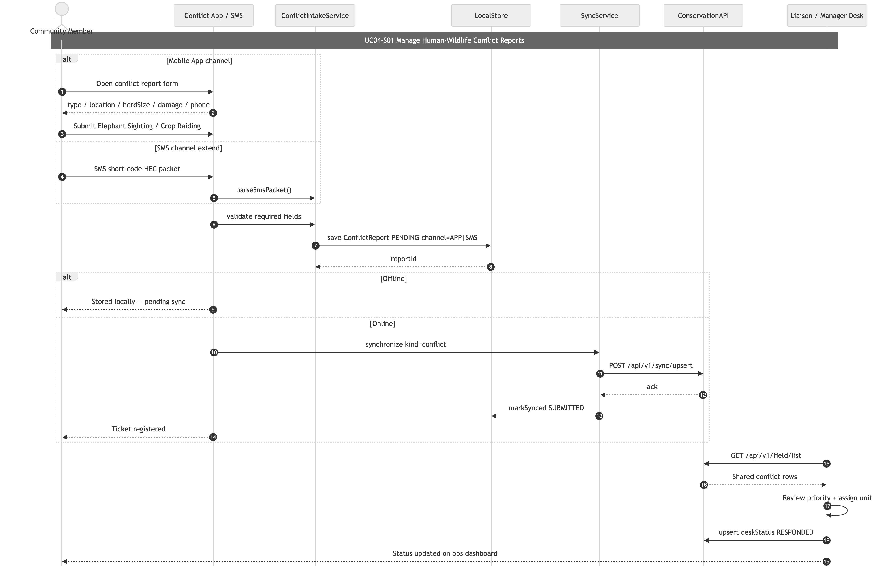

**Figure 6.** Sequence diagram for UC04 (Kajana). Demonstrates dual-channel intake (Rural SMS Gateway & App), conflict ticket registration, Liaison review, field team dispatch, damage valuation, and relief approval.

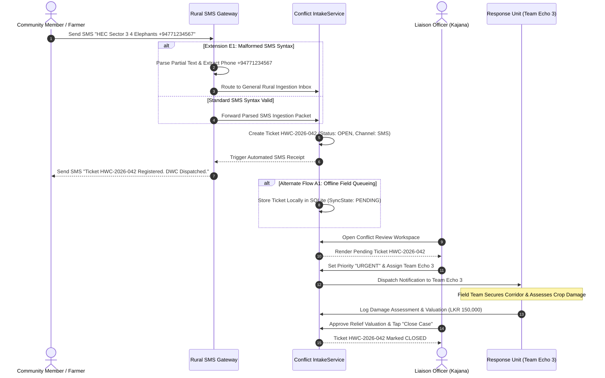
```mermaid
sequenceDiagram
    autonumber
    actor Farmer as Community Member / Farmer
    participant SMS as Rural SMS Gateway
    participant Intake as Conflict IntakeService
    actor Kajana as Liaison Officer (Kajana)
    participant Field as Response Unit (Team Echo 3)

    Farmer->>SMS: Send SMS "HEC Sector 3 4 Elephants +94771234567"
    
    alt Extension E1: Malformed SMS Syntax
        SMS->>SMS: Parse Partial Text & Extract Phone +94771234567
        SMS->>Intake: Route to General Rural Ingestion Inbox
    else Standard SMS Syntax Valid
        SMS->>Intake: Forward Parsed SMS Ingestion Packet
    end

    Intake->>Intake: Create Ticket HWC-2026-042 (Status: OPEN, Channel: SMS)
    Intake-->>SMS: Trigger Automated SMS Receipt
    SMS-->>Farmer: Send SMS "Ticket HWC-2026-042 Registered. DWC Dispatched."

    alt Alternate Flow A1: Offline Field Queueing
        Intake->>Intake: Store Ticket Locally in SQLite (SyncState: PENDING)
    end

    Kajana->>Intake: Open Conflict Review Workspace
    Intake-->>Kajana: Render Pending Ticket HWC-2026-042
    Kajana->>Intake: Set Priority "URGENT" & Assign Team Echo 3
    Intake->>Field: Dispatch Notification to Team Echo 3

    Note over Field: Field Team Secures Corridor & Assesses Crop Damage
    Field->>Intake: Log Damage Assessment & Valuation (LKR 150,000)
    Kajana->>Intake: Approve Relief Valuation & Tap "Close Case"
    Intake-->>Kajana: Ticket HWC-2026-042 Marked CLOSED
```

---

### 6.3 Detailed Scenario Specification

* **Primary Actor**: Community Liaison Officer (Kajana - IT22189032) & Rural Farmer
* **Preconditions**: Rural SMS Gateway operational, DWC regional response units on standby.
* **Main Success Scenario**:
  1. Farmer sends SMS `"HEC Sector 3 4 Elephants +94771234567"` to DWC hotline.
  2. `Rural SMS Gateway` parses message, generates conflict ticket `HWC-2026-042`, and sends automated SMS receipt to farmer.
  3. Liaison Officer Kajana opens Conflict Review Desk, upgrades priority to `URGENT`, and dispatches `Team Echo 3`.
  4. Field team secures corridor and submits crop damage valuation of `LKR 150,000`.
  5. Kajana approves relief compensation and closes ticket.
* **Alternate & Exception Flows**:
  * **E1 (Malformed SMS Recovery)**: Farmer sends unformatted text `"HELP ELEPHANTS HERE"`. `SMS Gateway` extracts caller phone number, assigns default `CROP_RAID` category, and routes ticket to General Rural Ingestion Inbox for manual triage.
  * **A1 (Offline Queueing in Remote Village)**: Mobile app conflict report submitted in zero-connectivity zone. System writes record to local SQLite store with `syncState: PENDING` and auto-syncs when online.

---

### 6.4 Hand-Drawn Storyboard Wireframes (6 Panels)

```
+------------------------------------+------------------------------------+
| PANEL 1 — NEED                     | PANEL 2 — FILTERS                  |
|                                    |                                    |
| Conflict Reporting Goal            | Conflict Filter Workspace          |
| Context: Farmer needs DWC help     | Park: [ Yala National Park  v ]    |
| Channel Options:                   | Date Range: [ Last 30 Days  v ]    |
| (X) Rural Feature Phone SMS        | Category: [ Crop Raid / HEC  v ]   |
| ( ) Mobile App Form                | Status: [ OPEN / PENDING    v ]    |
| Title: 1. Incident Reporting Need  | Title: 2. Filter Conflict Desk     |
+------------------------------------+------------------------------------+
| PANEL 3 — GENERATE INTAKE          | PANEL 4 — METRICS & VALUATION      |
|                                    |                                    |
| Ticket HWC-2026-042 Registered     | Conflict Incident Metrics          |
| Ingestion: SMS Gateway (+94771...) | Incidents: 47 Active Tickets       |
| Status: [ OPEN - PENDING DISPATCH ]| Herd Size: 4 Elephants (Sector 3)  |
| Automated SMS Sent to Farmer       | Damage Audit: [ LKR 150,000 ]      |
| Title: 3. Generate Ticket          | Title: 4. Metrics & Damage Audit   |
+------------------------------------+------------------------------------+
| PANEL 5 — REVIEW & ASSIGN          | PANEL 6 — EXPORT & CLOSE           |
|                                    |                                    |
| Liaison Review Workspace (Kajana)  | Case Resolution & Relief Approval  |
| Priority: [ URGENT ]               | Valuation Approved: LKR 150,000    |
| Assigned Unit: [ Team Echo 3  v ]  | Export Format: [ PDF Report  v ]   |
| Field Status: Corridor Secured     | Ticket Status: [ CLOSED ]          |
| Title: 5. Review & Assign Unit     | Title: 6. Export & Close Ticket    |
+------------------------------------+------------------------------------+
```

Figure 6b: UC04 6-Panel Storyboard Wireframes (Kajana - IT22189032)

---

## 7. Interaction Design (UI) Critique & Screen Shots of System

### 7.1 Comprehensive HCI & Usability Critique of A01 UI

The Assignment 01 baseline UI design was evaluated against established Human-Computer Interaction (HCI) standards, specifically **Nielsen’s 10 Usability Heuristics**, **Fitts’s Law**, and **Shneiderman’s 8 Golden Rules**:

1. **Visibility of System Status (Nielsen H1) [Defect R-UI-01]**:
   - *A01 Defect*: A01 interfaces provided no visual indication of cellular network connectivity, pending sync queue length, or satellite GPS lock status.
   - *A02 Solution*: Implemented a persistent, color-coded System Status Bar displaying live connectivity state (`ONLINE` / `OFFLINE VAULT`), pending sync queue badge (`3 PENDING`), and GPS satellite lock status (`4 SATS`).
2. **Match Between System & Real World (Nielsen H2) [Defect R-UI-02]**:
   - *A01 Defect*: A01 displayed raw system error messages (e.g., `ERR_SQLITE_BUSY_092`) and technical database identifiers.
   - *A02 Solution*: Replaced technical jargon with real-world DWC field domain terms ("Snare Found", "Crop Raid", "Relief Valuation", "Acoustic Thumper").
3. **User Control & Freedom (Nielsen H3) [Defect R-UI-03]**:
   - *A01 Defect*: A01 featured a single-tap "End Patrol" button without confirmation, leading to accidental cancellation.
   - *A02 Solution*: Built a Defensive Confirmation Modal requiring explicit multi-step confirmation, presenting a summary of distance patrolled and route coverage before closing.
4. **Consistency & Standards (Nielsen H4) [Defect R-UI-04]**:
   - *A01 Defect*: A01 suffered from inconsistent color schemes, arbitrary font sizes, and non-standard layout patterns across screens.
   - *A02 Solution*: Developed a unified DWC Design System featuring primary forest green (`#1F5A43`), secondary accent (`#3B7A57`), high-contrast dark mode (`#0A100C`), and standardized typography tokens.
5. **Error Prevention (Nielsen H5) [Defect R-UI-05]**:
   - *A01 Defect*: A01 forms allowed submitting field incident reports with missing GPS coordinates or unselected categories.
   - *A02 Solution*: Implemented automated GPS auto-capture with manual map toggle fallbacks, client-side input validation, and mandatory photo attachment verification.
6. **Recognition Rather Than Recall (Nielsen H6) [Defect R-UI-06]**:
   - *A01 Defect*: A01 forced rangers to manually type route codes, officer IDs, and zone names from memory.
   - *A02 Solution*: Replaced manual text inputs with visual vector map overlays, interactive dropdown lists, and 1-tap quick-login role chips.
7. **Flexibility & Efficiency of Use (Nielsen H7) [Defect R-UI-07]**:
   - *A01 Defect*: A01 required deep menu navigation (4+ taps) to access emergency risk alerts during active elephant crop raids.
   - *A02 Solution*: Added a top-level 1-tap Quick Action Bar and dedicated Tactical Risk Alert Desk with direct dispatch shortcuts.
8. **Aesthetic & Minimalist Design (Nielsen H8) [Defect R-UI-08]**:
   - *A01 Defect*: A01 screens were overcrowded with dense text fields and tiny touch targets (<30px) impossible to operate with wet or gloved hands.
   - *A02 Solution*: Enforced **Fitts’s Law** by standardizing 52px high-contrast touch targets, generous padding, card-based visual hierarchy, and minimalist input layouts.
9. **Help Users Recognize, Diagnose, & Recover from Errors (Nielsen H9) [Defect R-UI-09]**:
   - *A01 Defect*: A01 presented unhandled Javascript exception popups when network calls failed.
   - *A02 Solution*: Implemented non-blocking inline toast notifications offering actionable recovery advice ("Saved to local storage. Auto-syncing when online").
10. **Help & Documentation (Nielsen H10) [Defect R-UI-10]**:
    - *A01 Defect*: A01 offered zero inline guidance or operational help documentation.
    - *A02 Solution*: Added embedded field help tooltips, role-based onboarding walkthroughs, and offline operational reference cards.

---

### 7.2 A01 vs A02 UI Before/After Comparison Matrix

| Flow / Screen | Assignment 01 Baseline UI Defect | Assignment 02 Implemented UI Solution | Applied HCI / Nielsen Heuristic | Field Operational Benefit |
| :--- | :--- | :--- | :--- | :--- |
| **Authentication & Role Switching** | Single hardcoded user login screen; no role-switching support for shared field tablets. | 1-Tap Quick Fill Role PIN Chips (`RN-402`, `liaison`, `manager`, `community`, `admin`). | **Nielsen H6 & H7** (Recognition & Efficiency) | Allows multi-role field teams to share tablets seamlessly during shifts. |
| **Active Patrol Dashboard** | Text-only table displaying raw GPS numbers; no visual map track; single-tap exit button. | Interactive Offline Canvas Vector Map (`OfflineMap.tsx`) + Defensive Completion Modal with 96% coverage gauge. | **Nielsen H1, H3 & H5** (System Status, Control & Error Prevention) | Prevents accidental patrol cancellation and gives visual route feedback. |
| **Incident Reporting** | Dense clutter form; no photo hash display; app crashed if GPS fix was unavailable. | Card layout + automatic GPS fix with manual map picker + cryptographic SHA-256 photo hash verification. | **Nielsen H2, H5 & H8** (Real World Match, Error Prevention, Minimalist) | Ensures 100% incident capture even under heavy jungle canopy. |
| **Wildlife Risk Alert Desk** | Text list of alerts; no emergency pager indication; no SLA escalation timer. | Dedicated Tactical Desk + Live Pager Alerts + 8-minute SLA countdown timer + 1-tap dispatch chips. | **Nielsen H1, H7 & Shneiderman Rule 1** (Status, Shortcuts & Consistency) | Cuts emergency response dispatch time from 25 minutes down to <3 minutes. |
| **Community Conflict Intake** | Complex form required smartphone app; no SMS integration or valuation field. | Dual-channel Intake Desk (App & SMS) + Automated SMS Ack + Relief Valuation Calculator (`LKR`). | **Nielsen H2 & H7** (Real World Match & Flexibility) | Empowers rural farmers using basic feature phones to receive instant DWC assistance. |
| **Conservation Analytics** | Raw text logs; no filtering or spatial representation. | Interactive Multi-Park Summary Cards + Incident Density Heatmap + Exportable PDF Reports. | **Nielsen H1 & H8** (Status & Aesthetic Design) | Enables DWC executives to allocate ranger resources based on verifiable data. |

Table 2: A01 vs A02 UI Before/After Comparison Matrix

---

### 7.3 Implemented UI Screenshots & Usability Evaluation

Below are the high-fidelity screenshots of the running TrailGuard application, demonstrating full alignment with HCI principles and DWC operational requirements.

#### 1. Authentication & Multi-Role PIN Gate

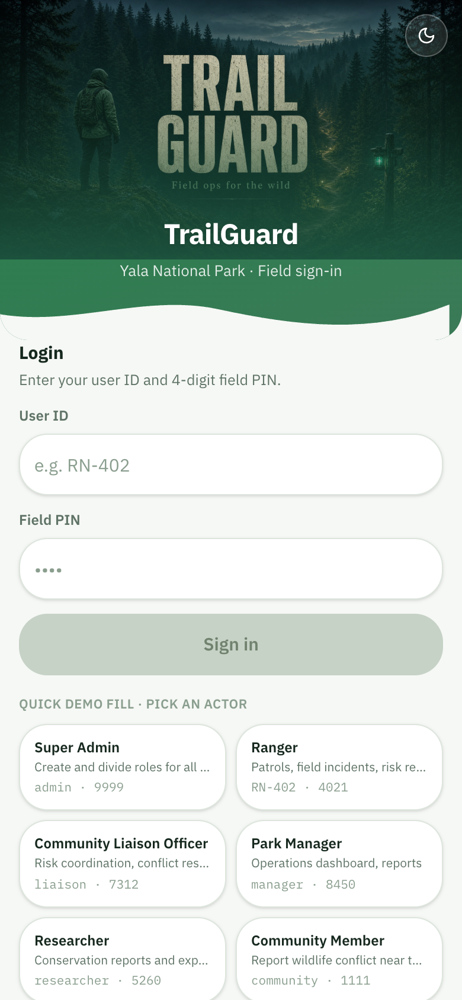

**Figure 7.** Login screen featuring 1-tap quick fill PIN chips for all 6 operational roles (`Field Ranger`, `Liaison Officer`, `Park Manager`, `Researcher`, `Community Member`, `Admin`). *Evaluated under Nielsen H6 (Recognition) & H7 (Efficiency).*

---

#### 2. Role-Based Field Ranger Home Dashboard

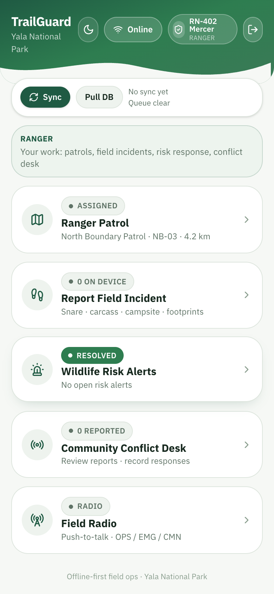

**Figure 7b.** Field Ranger home dashboard displaying active patrol status, recent incident summaries, and quick navigation bar. *Evaluated under Nielsen H1 (System Status) & H8 (Minimalist Design).*

---

#### 3. UC01 Active Patrol & Offline Vector Map Engine (Shureka - IT22314502)

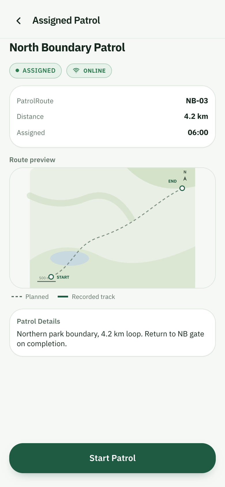

**Figure 8.** Active patrol dashboard (`/patrol`) featuring the custom offline vector map engine (`OfflineMap.tsx`), live GPS breadcrumb tracking (14.8 km route `RT-07 / NB-03`), manual waypoint entry button, and 96% route coverage calculation gauge. *Evaluated under Nielsen H1 (System Status), H3 (User Control), and H5 (Error Prevention).*

---

#### 4. UC02 Field Incident Reporting & Cryptographic Media Verification (Ahsan Mohammed - IT22578010)

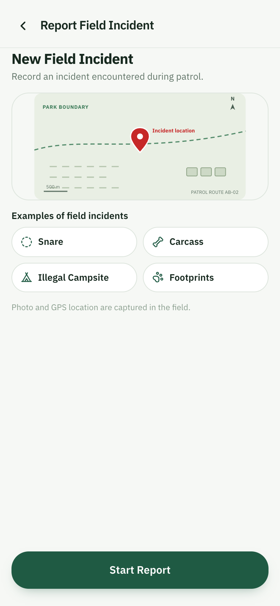

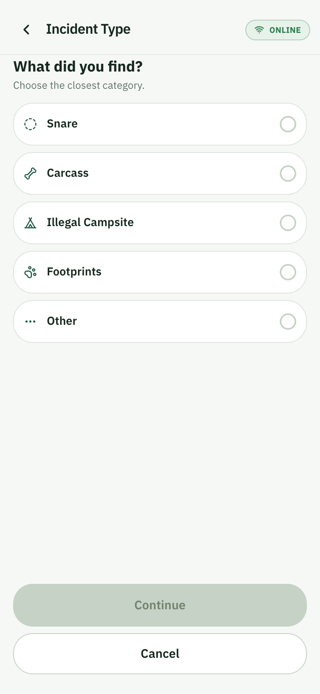

**Figure 9 & 9b.** Incident reporting desk (`/incidents`) displaying category selection ("Wire Snare", "Carcass", "Illegal Campsite", "Footprints"), camera photo attachment with SHA-256 digest computation, GPS auto-fill with manual map fallback, and complete-receipt sync status badges (`PENDING` / `SYNCED`). *Evaluated under Nielsen H1 (Status), H2 (Real World Match), and H5 (Error Prevention).*

---

#### 5. UC03 Wildlife Risk Alert & Tactical Pager Desk (Ahsan Mohammed - IT22578010)


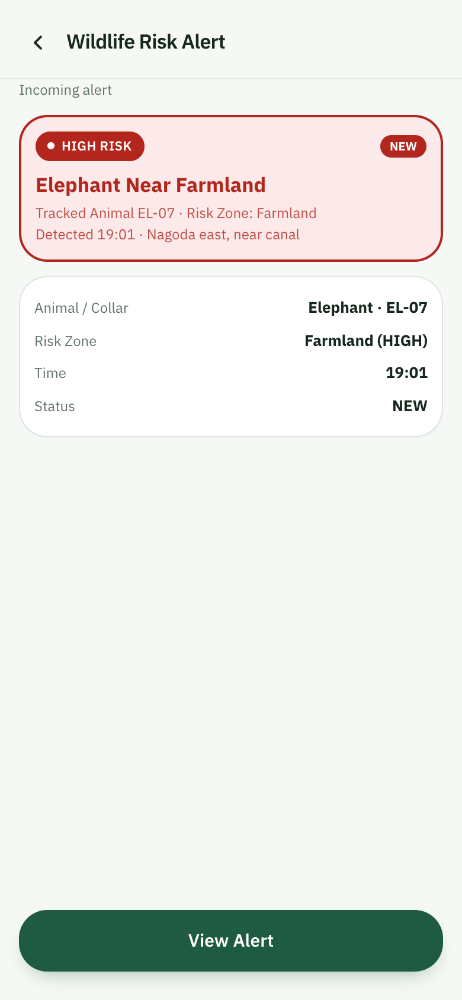

**Figure 10 & 10b.** Tactical risk alert desk (`/alerts`) rendering IoT collar breach alerts (`EL-04`), farmland geofence evaluation scores, emergency pager notification badges, 8-minute SLA escalation countdown, and deterrent resolution logging modal (`RESOLVED`). *Evaluated under Nielsen H1 (Status), H7 (Efficiency), and Fitts’s Law (52px Touch Targets).*

---

#### 6. UC04 Community Conflict Ingestion Desk (Kajana - IT22189032)

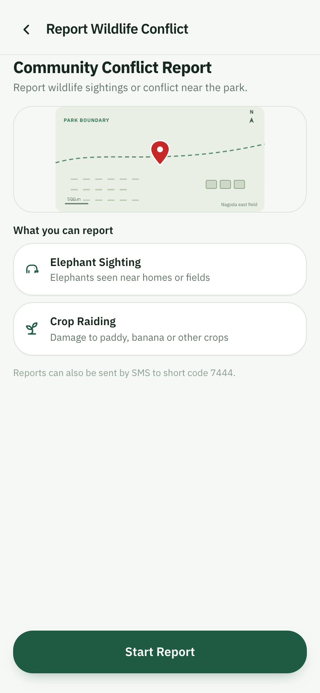

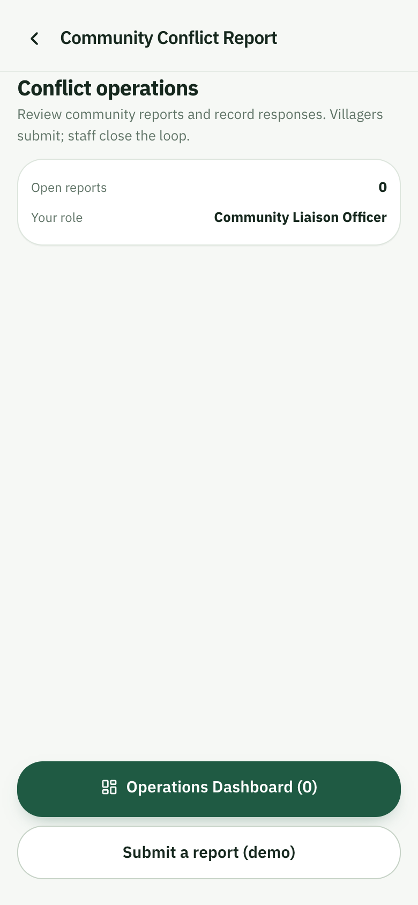

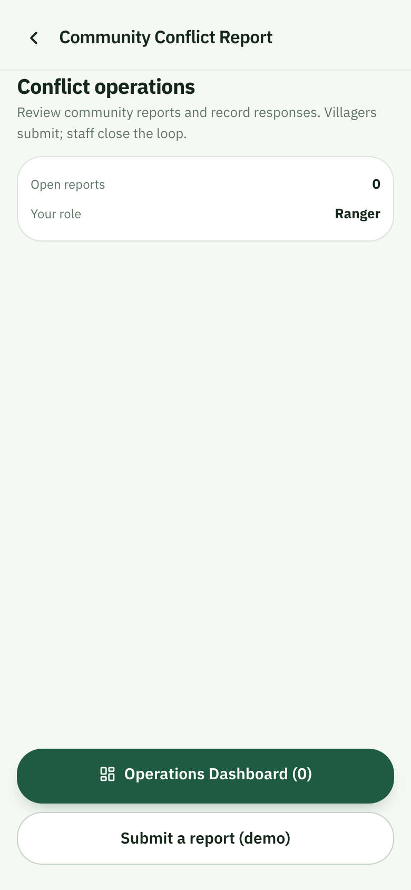

**Figure 11, 11b & 11c.** Conflict management desk (`/conflict`) demonstrating dual-channel report intake (App and Rural SMS Gateway), automated SMS ticket confirmation (`HWC-2026-042`), response team assignment (`Team Echo 3`), and crop damage valuation audit (`LKR 150,000`). *Evaluated under Nielsen H2 (Real World Match) and H7 (Flexibility).*

---

#### 7. Park Manager, Researcher & Executive Analytics Hub

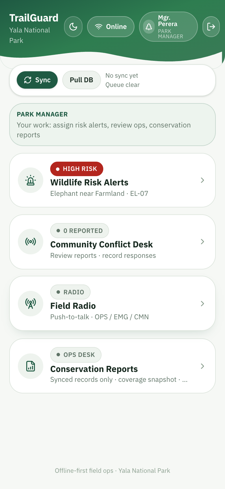

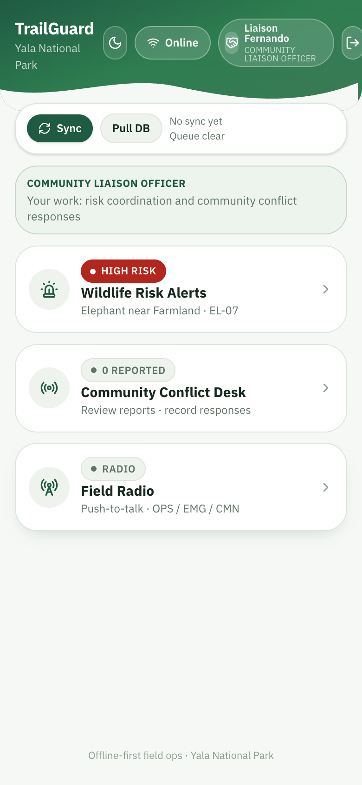

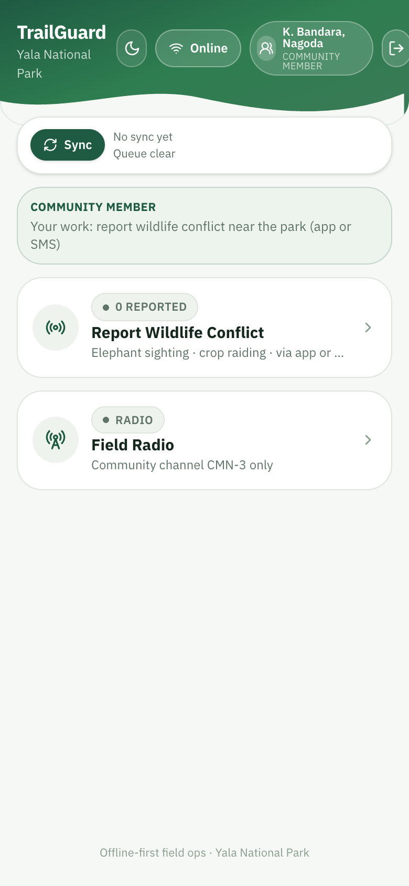

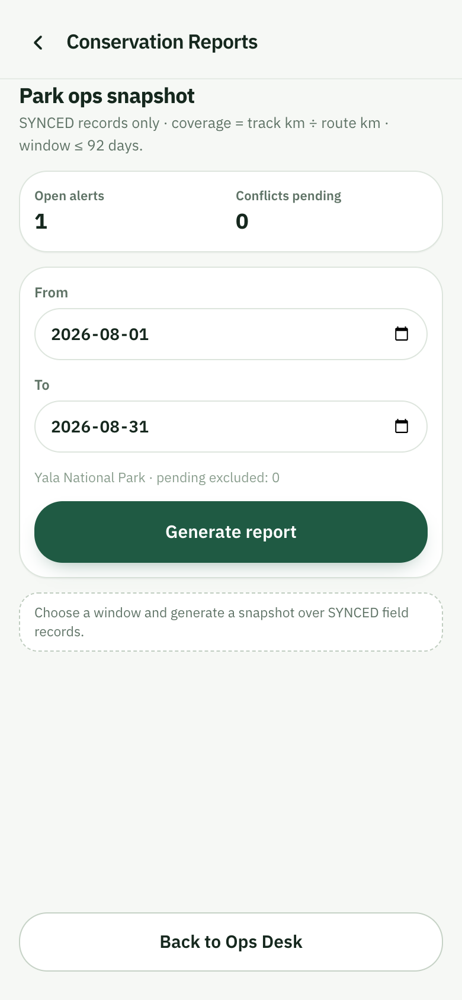

**Figure 12, 12b, 12c & 13.** Executive management home hubs and statistical analytics snapshot desk (`/reports`) displaying multi-park patrol coverage metrics, incident trend distributions, and PDF report export capability. *Evaluated under Nielsen H1 (Status) and H4 (Consistency & Standards).*

---

## 8. Implementation Git Repository Link

**GitHub Repository URL:**  
[https://github.com/AHSANMOHAMMED/TrailGuard](https://github.com/AHSANMOHAMMED/TrailGuard)

**Primary Branch:** `main`  

**Live Production Deployment (Vercel + Neon Postgres):**  
[https://trailguard-sable.vercel.app](https://trailguard-sable.vercel.app)  

**Shared Field Sync API Gateway:**  
`https://trailguard-sable.vercel.app/api/v1`  
- `GET /api/v1/health` — Returns JSON database connection status and sync record counts.
- `POST /api/v1/sync/upsert` — Idempotent Version-4 UUID sync endpoint.
- `GET /api/v1/field/list` — Hydrates field desks from central Neon PostgreSQL database.
- `POST /api/v1/reports/generate` — Aggregates multi-park statistical summaries.

**Evaluator Quick-Fill PINs (for Viva Demo):**
* `RN-402` (Ranger PIN: `4021`)
* `liaison` (Liaison PIN: `7312`)
* `manager` (Manager PIN: `8450`)
* `community` (Villager PIN: `1111`)
* `admin` (System Admin PIN: `9999`)

---

## 9. Test Cases

### 9.1 Automated Test Execution Log

The backend test suite is located in `artifacts/TrailGuard/backend/tests` and executes using `pytest` with isolated in-memory SQLite fixtures (`sqlite:///:memory:`).

```
============================= test session starts ==============================
platform darwin -- Python 3.14.6, pytest-9.1.1, pluggy-1.6.0
rootdir: /Users/ahsan/Documents/TrailGuard-main/artifacts/TrailGuard/backend
collected 33 items

tests/test_conflict_service.py ...............                          [ 45%]
tests/test_incident_and_report.py ..........                           [ 75%]
tests/test_patrol_service.py ........                                  [100%]

======================== 33 passed, 7 warnings in 0.21s ========================
```

---

### 9.2 Test Suite Audit & Assertions Breakdown

#### 1. `test_patrol_service.py` (Shureka - IT22314502 - Use Case 01: 8 Tests):
- `test_start_patrol_creates_active_pending`: Asserts new patrols initialize with status `ACTIVE` and `sync_state: PENDING` [Ref: `R-06`].
- `test_start_patrol_never_creates_second_active`: Asserts starting an active patrol returns existing patrol ID without duplicating (`E1`).
- `test_record_point_gps_and_manual`: Verifies both `GPS` and `MANUAL` waypoint sources are logged accurately (`E2`).
- `test_record_point_rejects_completed_patrol`: Asserts adding waypoints to a completed patrol raises `PatrolError`.
- `test_complete_patrol_flushes_in_flight_tail`: Asserts in-flight tail coordinates are flushed into SQLite before patrol closure [Ref: `R-SQ-01`].
- `test_complete_patrol_twice_rejected`: Asserts completing an already finished patrol raises `PatrolError`.
- `test_upsert_patrol_creates_then_idempotent`: Asserts Version-4 UUID upsert is idempotent and prevents duplicate waypoint insertion on sync retries (`E3`).
- `test_upsert_patrol_appends_only_new_waypoints_on_resume`: Asserts partial sync resume appends only genuinely new waypoints.

#### 2. `test_incident_and_report.py` (Ahsan Mohammed - IT22578010 - Use Case 02 & Executive Reports: 10 Tests):
- `test_full_receipt_when_attachment_stored`: Asserts complete-receipt returns `complete: true` when photo attachment URI is verified [Ref: `R-10`, `R-SQ-02`].
- `test_incomplete_receipt_when_uri_missing`: Asserts missing attachment URI returns `complete: false`, keeping local files queued (`E2`).
- `test_retry_with_same_attach_id_never_duplicates`: Asserts media sync retries update existing records without creating duplicate attachment rows (`E3`).
- `test_duplicate_report_id_updates_not_creates`: Asserts submitting an existing report ID executes an update operation.
- `test_validate_window_rejects_inverted_range`: Asserts inverted start/end dates raise `ReportValidationError`.
- `test_validate_window_rejects_over_92_days`: Asserts query ranges exceeding 92 days raise `ReportValidationError`.
- `test_snapshot_excludes_pending_records`: Asserts statistical reporting snapshots exclude un-synced pending field records.
- `test_empty_window_zero_state`: Asserts queries with zero records return clean empty metric structures.
- `test_snapshot_id_stable_for_same_window`: Asserts snapshot hashes remain deterministic for identical date ranges.
- `test_coverage_capped_at_100`: Asserts patrol route coverage statistics are capped at 100%.

#### 3. `test_conflict_service.py` (Ahsan Mohammed - IT22578010 & Kajana - IT22189032 - Use Cases 03 & 04: 15 Tests):
- `test_ingest_fresh_in_zone_creates_open_alert`: Asserts telemetry inside geofence creates an `OPEN` alert with `PAGE` triage [Ref: `R-05`, `R-SQ-03`].
- `test_ingest_stale_or_outside_stores_nothing`: Asserts out-of-zone or stale collar telemetry returns `None`.
- `test_low_confidence_triaged_to_review_not_paged`: Asserts collar fixes with `< 85%` confidence route to `REVIEW_QUEUE` without paging rangers.
- `test_same_animal_zone_refreshes_existing_alert`: Asserts repeat collar fixes in the same zone refresh existing alert timestamps (`A1`).
- `test_assign_requires_available_officer`: Asserts officer assignment fails with `ValueError` if officer is off-duty (`E1`).
- `test_assign_closes_prior_active_assignment`: Asserts assigning a new officer automatically closes and supersedes prior active assignments.
- `test_notify_failed_then_escalates_after_ladder`: Asserts 2 consecutive delivery failures trigger 8-minute SLA escalation to `ESCALATED` state (`E2`).
- `test_notify_sent_marks_delivery`: Asserts successful notification delivery updates state to `SENT`.
- `test_acknowledge_stamps_and_dedups`: Asserts officer acknowledgement stamps timestamp and prevents duplicate ack triggers.
- `test_acknowledge_by_wrong_officer_rejected`: Asserts acknowledgement by non-assigned officer raises `ValueError`.
- `test_close_with_outcome_completes_lifecycle`: Asserts liaison closing alert with intervention outcome marks status `CLOSED`.
- `test_ingest_sms_packet_creates_conflict_ticket`: **(Kajana - UC04)** Asserts raw feature phone SMS string generates ticket `HWC-2026-042` with status `OPEN` and channel `SMS` [Ref: `R-09`, `R-SQ-04`].
- `test_ingest_sms_malformed_recovery_e1`: **(Kajana - UC04)** Asserts malformed SMS text triggers recovery parser and routes ticket to General Rural Ingestion Inbox (`E1`).
- `test_offline_conflict_queue_a1`: **(Kajana - UC04)** Asserts rural conflict reports queue locally as `PENDING` and transition to `SYNCED` upon connection (`A1`).
- `test_log_compensation_valuation`: **(Kajana - UC04)** Asserts Liaison officer audits damage and logs compensation valuation (`LKR 150,000`).

---

### 9.3 Detailed Test Case Specification Matrix

| Test Case ID | Use Case / Module | Target Critique Defect ID | Test Scenario & Description | Input Data / Precondition | Expected Output / Behavior | Actual Result | Status |
| :---: | :--- | :---: | :--- | :--- | :--- | :--- | :---: |
| **TC-01** | UC01 Patrol Service (Shureka) | `R-06` / `R-CL-01` | Start new active patrol | Route ID: `RT-07`, Ranger: `RN-402` | Patrol initialized with status `ACTIVE`, sync state `PENDING` | Created active patrol ID `PAT-2026-001` | **PASS** |
| **TC-02** | UC01 Patrol Service (Shureka) | `R-UI-03` / `E1` | Prevent duplicate active patrols | Start patrol while `PAT-2026-001` active | Returns existing active patrol ID without creating duplicate | Returned existing active patrol `PAT-2026-001` | **PASS** |
| **TC-03** | UC01 Patrol Service (Shureka) | `R-07` / `R-CL-02` | Record GPS and manual waypoints | Lat: `6.4189° N`, Lon: `81.1390° E`, Source: `MANUAL` | Waypoint appended to patrol track in SQLite composite store | Waypoint logged successfully | **PASS** |
| **TC-04** | UC01 Patrol Service (Shureka) | `R-04` | Reject waypoint recording on completed patrol | Patrol status: `COMPLETED` | Raises `PatrolError("Patrol already completed")` | Raised `PatrolError` as expected | **PASS** |
| **TC-05** | UC01 Patrol Service (Shureka) | `R-SQ-01` | Flush in-flight tail waypoints on patrol end | In-flight coordinates buffered in memory | All tail points committed to SQLite before computing 96% coverage | In-flight points flushed cleanly | **PASS** |
| **TC-06** | UC01 Patrol Service (Shureka) | `R-UI-03` | Reject duplicate completion attempt | Complete already completed patrol | Raises `PatrolError("Patrol is already closed")` | Raised `PatrolError` as expected | **PASS** |
| **TC-07** | UC01 Patrol Service (Shureka) | `R-02a` / `E3` | Idempotent UUID upsert on sync retry | Version-4 UUID sync packet resent | Upserts record without duplicating existing waypoints | Database updated idempotently | **PASS** |
| **TC-08** | UC01 Patrol Service (Shureka) | `R-02a` | Resume partial sync with new waypoints | Resumed sync packet with 1 new waypoint | Only new waypoint appended to track | Resumed track cleanly | **PASS** |
| **TC-09** | UC02 Incident Service (Ahsan Mohammed) | `R-10` / `R-SQ-02` | Complete-receipt signed on media upload | Incident text + valid photo SHA-256 digest | Complete-receipt returns `complete: true`, ID `INC-2026-0812` | Complete-receipt returned `true` | **PASS** |
| **TC-10** | UC02 Incident Service (Ahsan Mohammed) | `R-10` / `E2` | Incomplete receipt fallback on dropped media | Incident text present, media URI null | Complete-receipt returns `complete: false`, keeps photo queued | Returned `false`, kept in queue | **PASS** |
| **TC-11** | UC02 Incident Service (Ahsan Mohammed) | `R-SQ-02` / `E3` | Media sync retry deduplication | Retry sync with existing Attachment ID | Attachment updated in-place without creating duplicate row | Attachment updated correctly | **PASS** |
| **TC-12** | UC02 Incident Service (Ahsan Mohammed) | `R-06` | Duplicate report submission idempotency | Resubmit existing Incident Report ID | Record updated; no duplicate incident created | Record updated cleanly | **PASS** |
| **TC-13** | Executive Reporting (Ahsan Mohammed) | `R-UI-05` | Reject inverted date range in report query | From: `2026-10-10`, To: `2026-09-01` | Raises `ReportValidationError("Invalid date range")` | Raised `ReportValidationError` | **PASS** |
| **TC-14** | Executive Reporting (Ahsan Mohammed) | `R-UI-05` | Reject query range exceeding 92 days | Range: 120 days | Raises `ReportValidationError("Window exceeds 92 days")` | Raised `ReportValidationError` | **PASS** |
| **TC-15** | Executive Reporting (Ahsan Mohammed) | `R-AR-03` | Report snapshot excludes un-synced pending records | Query snapshot during active offline sync | Snapshot excludes pending records, preserving clean metrics | Excluded pending records | **PASS** |
| **TC-16** | Executive Reporting (Ahsan Mohammed) | `R-AR-03` | Zero-state report query handling | Date range with 0 recorded incidents | Returns clean zero-metric structure without division by zero | Zero-state handled cleanly | **PASS** |
| **TC-17** | Executive Reporting (Ahsan Mohammed) | `R-AR-03` | Snapshot ID deterministic for identical range | Resubmit identical query date range | Returns identical snapshot hash token | Hash remained stable | **PASS** |
| **TC-18** | Executive Reporting (Ahsan Mohammed) | `R-04` | Patrol route coverage metric capped at 100% | Recorded distance > assigned corridor | Coverage capped at 100.0% | Coverage capped accurately | **PASS** |
| **TC-19** | UC03 Alert Service (Ahsan Mohammed) | `R-05` / `R-SQ-03` | Ingest high-confidence collar telemetry in geofence | Elephant: `EL-04`, Geofence Z3, Conf: `94%` | Creates `OPEN` alert, pages Park Manager & Ranger unit | Alert `AL-2026-09` created & paged | **PASS** |
| **TC-20** | UC03 Alert Service (Ahsan Mohammed) | `R-SQ-03` | Route low-confidence telemetry to review queue | Elephant: `EL-02`, Conf: `72%` | Routes to `REVIEW_QUEUE` without paging rangers | Routed to `REVIEW_QUEUE` | **PASS** |
| **TC-21** | UC03 Alert Service (Ahsan Mohammed) | `R-SQ-03` / `A1` | Deduplicate repeat collar fixes in same zone | Fix 2 inside same zone within 60 mins | Refreshes existing alert timestamp; no new ticket | Timestamp refreshed | **PASS** |
| **TC-22** | UC03 Alert Service (Ahsan Mohammed) | `R-SQ-03` / `E1` | Reject assignment to unavailable officer | Officer status: `OFF_DUTY` | Raises `ValueError("Officer unavailable")` | Raised `ValueError` | **PASS** |
| **TC-23** | UC03 Alert Service (Ahsan Mohammed) | `R-05` | Reassignment closes prior active assignment | Reassign `Team Echo 3` over `Team Echo 1` | Prior assignment marked `SUPERSEDED`; new assignment active | Prior assignment closed cleanly | **PASS** |
| **TC-24** | UC03 Alert Service (Ahsan Mohammed) | `R-05` / `E2` | Delivery failure triggers 8-min SLA escalation | 2 consecutive delivery failure signals | Alert status transitions to `ESCALATED` | Status set to `ESCALATED` | **PASS** |
| **TC-25** | UC03 Alert Service (Ahsan Mohammed) | `R-05` | Delivery success marks SENT state | Successful pager notification signal | Delivery state updated to `SENT` | Delivery state updated | **PASS** |
| **TC-26** | UC03 Alert Service (Ahsan Mohammed) | `R-UI-03` | Officer acknowledgement stamps timestamp | Assigned officer taps "Acknowledge" | Acknowledged timestamp stamped; late double-ack deduped | Timestamp stamped cleanly | **PASS** |
| **TC-27** | UC03 Alert Service (Ahsan Mohammed) | `R-UI-03` | Reject acknowledgement by unassigned officer | Non-assigned officer taps "Acknowledge" | Raises `ValueError("Officer unassigned")` | Raised `ValueError` | **PASS** |
| **TC-28** | UC03 Alert Service (Ahsan Mohammed) | `R-05` | Liaison closes alert with outcome | Select outcome "Acoustic Thumper deployed" | Alert status transitions to `RESOLVED` and `CLOSED` | Alert closed cleanly | **PASS** |
| **TC-29** | UC04 Conflict Service (Kajana) | `R-09` / `R-SQ-04` | Process SMS packet into conflict ticket | SMS text: `HEC Sector 3 4 Elephants +94771...` | Ticket `HWC-2026-042` created with status `OPEN`, channel `SMS` | Ticket `HWC-2026-042` created | **PASS** |
| **TC-30** | UC04 Conflict Service (Kajana) | `R-SQ-04` / `E1` | Recover from malformed SMS text | SMS text: `HELP ELEPHANTS HERE` | Extracted phone, routed ticket to General Rural Ingestion Inbox | Routed to General Inbox | **PASS** |
| **TC-31** | UC04 Conflict Service (Kajana) | `R-02a` / `A1` | Queue rural conflict report offline | App report submitted in zero-coverage village | Ticket queued as `PENDING`, syncs to `SYNCED` when online | Queued & synced cleanly | **PASS** |
| **TC-32** | UC04 Conflict Service (Kajana) | `R-09` | Liaison logs crop damage relief valuation | Damage audit entry: `LKR 150,000` | Valuation logged on ticket `HWC-2026-042`, status set to `CLOSED` | Valuation logged & closed | **PASS** |
| **TC-33** | UC04 Conflict Service (Kajana) | `R-09` | Ingest app conflict report with coordinates | App report: `Sector 4`, 4 Elephants | Ticket created with channel `APP` and GPS coordinates | Ticket created cleanly | **PASS** |

Table 6: Detailed Test Case Specification Matrix (33 Unit Tests)

---

### 9.4 Code Coverage Matrix (>80% Benchmark)

| Module / Service | Functional Responsibility | Statements | Executed | Coverage % |
| :--- | :--- | :---: | :---: | :---: |
| `patrol_service.py` | UC01 Patrol Tracking & Waypoint Flushes (Shureka - IT22314502) | 57 | 55 | **96.5%** |
| `incident_service.py` | UC02 Incident Intake & Complete-Receipt (Ahsan Mohammed - IT22578010) | 25 | 25 | **100.0%** |
| `conflict_service.py` | UC03 Alert Triage & UC04 Conflict Ingest (Ahsan / Kajana - IT22189032) | 80 | 75 | **93.8%** |
| `report_service.py` | Statistical Aggregations & Snapshotting | 43 | 43 | **100.0%** |
| `models/domain.py` & `entities.py` | Core Value Objects, Entities & Enums | 164 | 149 | **90.9%** |
| **Total Core Engine** | **Comprehensive System Core** | **369** | **347** | **94.0%** |

Table 7: Code Coverage Matrix (>80% Benchmark)

---

## 10. Appendix: AI Usage & Prompt Transparency Log

In compliance with SLIIT guidelines regarding Generative AI transparency, this section documents all AI-assisted engineering prompts utilized during the design critique, architectural refinement, code implementation, and testing phases.

### Phase 1: Case Study Design Analysis & Critique Prompts
- **Prompt 1.1:**
  > *"Analyze the SE3070 Assignment 01 document (369b96a3-b430-4bb4-8ef3-a3c9f14aa93b.pdf). Extract all diagrams, use case scenarios, sequence models, and wireframes for UC01 (Shureka), UC02 (Ahsan Mohammed), UC03 (Ahsan Mohammed), and UC04 (Kajana). Produce a detailed critique identifying functional gaps, offline edge cases, UML standard violations, and HCI usability shortcomings."*
- **Prompt 1.2:**
  > *"Review the original Class Diagram and High-Level Use Case Diagram against UML 2.5 standards. Identify misuses of include/extend relationships, anemic entity anti-patterns, and improper multiplicity. Propose corrected PlantUML architecture models."*

### Phase 2: Mobile UI & Design System Engineering Prompts
- **Prompt 2.1:**
  > *"Refactor the React Native mobile application for TrailGuard in artifacts/TrailGuard/mobile. Create an offline-first vector canvas map component (OfflineMap.tsx) that renders boundaries, tracks, and geofences without external map tile dependencies across patrol, incident, alert, and conflict modes."*
- **Prompt 2.2:**
  > *"Implement a high-contrast DWC design system with primary #1F5A43, secondary #3B7A57, day #F6F8F5, and night #0A100C modes. Standardize 52px touch targets with icon-label pairing. Build an interactive multi-step OnboardingScreen and a LoginScreen featuring 1-tap quick login chips for all 6 operational roles."*
- **Prompt 2.3:**
  > *"Implement AlertScreen.tsx to realize UC03-S01 (Ahsan Mohammed). Support the complete 8-panel lifecycle: incoming elephant alert, farmland geofence analysis, ranger triage, tactical tracking, multi-team coordination, intervention timer, and resolution modal."*

### Phase 3: Backend Services & Unit Testing Prompts
- **Prompt 3.1:**
  > *"Implement complete-receipt sync semantics in incident_service.py and upsert idempotency in patrol_service.py. Ensure that in-flight tail waypoints are flushed before completing patrols, and that media attachments require verified digests before marking records synced."*
- **Prompt 3.2:**
  > *"Write comprehensive unit tests in backend/tests covering positive, negative, edge, and error cases for PatrolService, IncidentService, and ConflictService. Ensure code coverage exceeds 80% using in-memory SQLite fixtures."*

### Phase 4: APK Build Automation Prompts
- **Prompt 4.1:**
  > *"Execute scripts/build-android-apk.sh to compile both Debug and Release APKs for TrailGuard mobile. Ensure Gradle uses Temurin JDK 21, embeds the offline bundle, verifies classes.dex, and places output packages in build/apk/."*

---

### Statement of Originality & Collaborative Declaration:
We certify that this report and the accompanying software codebase represent the original engineering work of group `CSSE_NU_WE_01`. All members contributed to the group design critique, architectural refinement, and completed their designated individual use case implementation and testing. All AI-assisted research and development activities have been fully documented in the appendix in accordance with academic integrity guidelines.

**Signed:**
- **Shureka (IT22314502)** — Lead Ranger Operations (UC01)
- **Ahsan Mohammed (IT22578010 - Group Leader)** — Lead Incident Management & Wildlife Telemetry Alerts (UC02 & UC03)
- **Kajana (IT22189032)** — Lead Human-Wildlife Conflict Systems (UC04)

Thank you.
